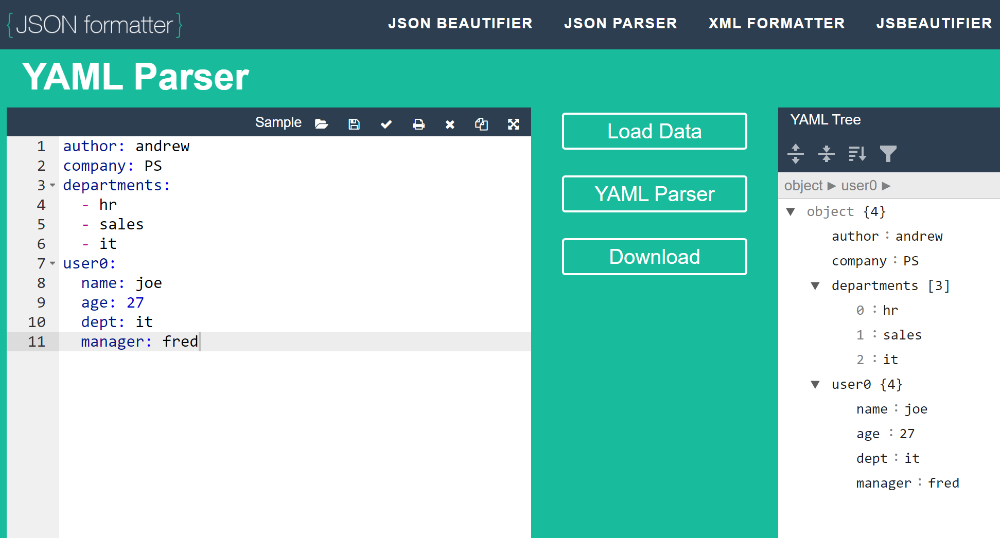

* https://app.pluralsight.com/course-player?clipId=667380ab-984f-46b3-a41c-747f83982556


cd ~/vagrant/ansible
vagrant up --parallel


* https://app.pluralsight.com/explore/certifications/topics/linux?trackId=43182a5e-279a-4ef6-808c-c3f62d01ed57&examPrepId=0e4f07d3-5443-4d9c-9331-2a886c87bdb6


# table of contents

- [table of contents](#table-of-contents)
- [Linux Administration with Ansible: Getting Started with Ansible Automation](#linux-administration-with-ansible-getting-started-with-ansible-automation)
- [Managing a growing linux estate](#managing-a-growing-linux-estate)
  - [introduction](#introduction)
  - [lab environment](#lab-environment)
    - [vagrant for lab builds](#vagrant-for-lab-builds)
  - [building the vagrant labs](#building-the-vagrant-labs)
    - [summary](#summary)
    - [setup](#setup)
  - [not all OSes are the same](#not-all-oses-are-the-same)
- [installing ansible](#installing-ansible)
- [understanding ansible components](#understanding-ansible-components)
  - [what makes up ansible?](#what-makes-up-ansible)
    - [`ansible` vs `ansible-playbook`](#ansible-vs-ansible-playbook)
    - [finding documentation](#finding-documentation)
    - [ansible playbooks](#ansible-playbooks)
    - [ansible facts and variables](#ansible-facts-and-variables)
    - [locating default values and host inventory](#locating-default-values-and-host-inventory)
- [managing the ansible config file](#managing-the-ansible-config-file)
  - [configuring ansible](#configuring-ansible)
    - [config hierarchy](#config-hierarchy)
  - [working with `ansible-config`](#working-with-ansible-config)
  - [create custom configs](#create-custom-configs)
  - [enforce a configuration](#enforce-a-configuration)
- [Managing ansible inventories](#managing-ansible-inventories)
  - [inventory types](#inventory-types)
  - [creating inventory file and undersatnd groups](#creating-inventory-file-and-undersatnd-groups)
  - [inventory output formats](#inventory-output-formats)
  - [implement inventory variables](#implement-inventory-variables)
  - [build dynamic inventories](#build-dynamic-inventories)
- [managing nodes using ad-hoc commands](#managing-nodes-using-ad-hoc-commands)
  - [place private keys for inventory hosts on the controller system](#place-private-keys-for-inventory-hosts-on-the-controller-system)
  - [establish the `tux` user account](#establish-the-tux-user-account)
  - [using variables](#using-variables)
- [Linux Administration with Ansible: Writing Ansible Playbooks](#linux-administration-with-ansible-writing-ansible-playbooks)
- [writing in yaml](#writing-in-yaml)
  - [understanding the yaml structure](#understanding-the-yaml-structure)
  - [choosing text editors and IDEs for yaml](#choosing-text-editors-and-ides-for-yaml)
  - [understanding playbooks](#understanding-playbooks)
  - [using variables and debugging playbooks](#using-variables-and-debugging-playbooks)
  - [locate python/ansible modules](#locate-pythonansible-modules)
- [scripting linux administration](#scripting-linux-administration)
- [using shell commands in playbook](#using-shell-commands-in-playbook)
  - [command versus shell modules](#command-versus-shell-modules)
    - [security:](#security)
  - [working with the ansible raw module](#working-with-the-ansible-raw-module)
  - [executing scripts withing the script module](#executing-scripts-withing-the-script-module)
  - [idempotentcy with creates](#idempotentcy-with-creates)
  - [using playbook/global vars](#using-playbookglobal-vars)
  - [Windows commands with win\_command](#windows-commands-with-win_command)
- [working with the big three](#working-with-the-big-three)
  - [what are the big three](#what-are-the-big-three)
  - [review the inventory](#review-the-inventory)
    - [listing inventory](#listing-inventory)
    - [listing membership](#listing-membership)
  - [managing statis service and packages](#managing-statis-service-and-packages)
  - [copy across multiple system types focusing on group\_vars](#copy-across-multiple-system-types-focusing-on-group_vars)
  - [managing chrony time server](#managing-chrony-time-server)
  - [using Handlers](#using-handlers)
  - [create the chrony playbook](#create-the-chrony-playbook)
- [managing users in ansible](#managing-users-in-ansible)
  - [creating users](#creating-users)
  - [managing user passwords](#managing-user-passwords)
  - [managing user auth keys](#managing-user-auth-keys)
  - [authenticate with new key pair](#authenticate-with-new-key-pair)
  - [using blocks and pushing a sudoers file to targets](#using-blocks-and-pushing-a-sudoers-file-to-targets)
- [ancillary ansible playbooks](#ancillary-ansible-playbooks)
  - [archiving files](#archiving-files)
  - [importing tasks](#importing-tasks)
  - [lab: create parent play, import children, understand scopes](#lab-create-parent-play-import-children-understand-scopes)
  - [managing VDO storage](#managing-vdo-storage)
    - [what is VDO?](#what-is-vdo)
    - [letsss gooooo](#letsss-gooooo)
  - [importing playbooks](#importing-playbooks)
- [configuring ssh client connectivity to vagrant controlled VMs](#configuring-ssh-client-connectivity-to-vagrant-controlled-vms)
- [jinja2 templating with ansible](#jinja2-templating-with-ansible)
  - [intro to templating](#intro-to-templating)
    - [jinja2 template delimiters](#jinja2-template-delimiters)
  - [ansible template module](#ansible-template-module)
  - [assigning vars within the inventory file](#assigning-vars-within-the-inventory-file)
  - [var substitution](#var-substitution)
  - [filters](#filters)
  - [conditionals](#conditionals)
    - [tests](#tests)
    - [comparisons](#comparisons)
    - [logical operators](#logical-operators)
  - [loops](#loops)
    - [workthrough magic variable groups\[\]](#workthrough-magic-variable-groups)
    - [using magic variables: hostvars](#using-magic-variables-hostvars)
  - [demo: deploy chrony config](#demo-deploy-chrony-config)
- [modular configuration with roles](#modular-configuration-with-roles)
  - [what are roles](#what-are-roles)
  - [role directory structure](#role-directory-structure)
    - [creating the role directory structure](#creating-the-role-directory-structure)
  - [create role content for ntp](#create-role-content-for-ntp)
  - [create playbook to tie the room together, man](#create-playbook-to-tie-the-room-together-man)
  - [converting from playbooks into roles](#converting-from-playbooks-into-roles)
    - [best practices for roles](#best-practices-for-roles)
    - [lab: split up a single lamp stack playbook into roles](#lab-split-up-a-single-lamp-stack-playbook-into-roles)


# Course 1: Linux Administration with Ansible: Getting Started with Ansible Automation

# Managing a growing linux estate

## introduction
* managing systems
* scripting solutions
* building lab system

## lab environment
* three VMs
* virtualbox, vagrant
* RHEL 8, ubuntu 20.04, centos stream

### vagrant for lab builds
* on host system
```
mkdir -p ~/vagrant/ansible
vim ~/vagrant/ansible/Vagrantfile
cd ~/vagrant/ansible
vagrant up --parallel
```

## building the vagrant labs

### summary
* on host OS
* create the required directories in the host file system
* create/download the Vagrantfile

### setup
1. sign up for redhat developer subscription
* https://developers.redhat.com/

2. install vagrant
* https://developer.hashicorp.com/vagrant/downloads and install

3. install virtualbox
* https://www.virtualbox.org/wiki/Downloads

4. create directories (in pwsh)
* having downloaded the course files, copy the `Vagrantfile` from there.
```
mkdir -f ~/vagrant/ansible
cd ~/vagrant/ansible
copy C:\repos\rhce\linux-administration-ansible-automation-getting-started\02\demos\Vagrantfile .\
cat .\Vagrantfile | % {$_ -replace "centos/stream8","bento/centos-stream-8"} | set-content .\Vagrantfile
```

5. run vagrant up, which will download all three distros, and create VMs.
* this will take a while (an hour or so) and may require initial interaction.
```
cd ~/vagrant/ansible
vagrant up --parallel
```

6. register the RHEL VM with redhat
```
cd ~/vagrant/ansible
vagrant ssh rhel8
# there is no longer a need to use auto-attach as simple content access is enabled by default on new dev subscriptions
sudo subscription-manager register --username mbrowndc --password []
# validate
[root@rhel8 vagrant]# subscription-manager status
+-------------------------------------------+
   System Status Details
+-------------------------------------------+
Overall Status: Disabled
Content Access Mode is set to Simple Content Access. This host has access to content, regardless of subscription status.

System Purpose Status: Disabled
```

7. some vagrant commands:
```
cd ~/vagrant/ansible

#check status of VMs
vagrant status

#shutdown VMs
vagrant halt

#power up VMs
vagrant up --parallel

#destroy VMs
vagrant destroy

#get shell on a system
vagrant ssh rhel8
#exit
```

## not all OSes are the same
* managing systems theory
  * connecting to each server in turn and esecutign commands needed to bring the system into the required stat
* scripting solutions was okay, but not great
* System differences
  * while discrete commands or scripts can managed the estate, as an administrator of more than one linux distro
  * various software packaging tools (apt, yum)
  * editor (vim, vim-enhanced)
  * time config (/etc/chrony/chrony.conf, /etc/chrony.conf)

# installing ansible
1. adding ansible repos and installing ansible
* we'll only really use ansible on the RHEL instance
```
# vagrant ssh rhel8
#check repos
sudo subscription-manager repos --list | grep ansible
sudo subscription-manager repos --enable ansible-2.9-for-rhel-8-x86_64-rpms
sudo yum repolist
#disable epel repo (which also has the ansible package) so that ansible repo is prioritized
sudo yum install -y dnf-plugins-core
sudo yum config-manager --disable epel epel-modular
sudo yum repolist
sudo yum install -y ansible

# vagrant ssh stream
sudo yum install -y epel-release
sudo yum install -y ansible

# vagrant ssh ubuntu
sudo apt-add-repository --yes --update ppa:ansible/ansible
sudo apt install ansible
```

2. versioning ansible
```
[vagrant@rhel8 ~]$ ansible --version
ansible 2.9.27
  config file = /etc/ansible/ansible.cfg
  configured module search path = ['/home/vagrant/.ansible/plugins/modules', '/usr/share/ansible/plugins/modules']
  ansible python module location = /usr/lib/python3.6/site-packages/ansible
  executable location = /usr/bin/ansible
  python version = 3.6.8 (default, Jun 14 2022, 09:19:35) [GCC 8.5.0 20210514 (Red Hat 8.5.0-13)]
```

3. investigating ansible from the CLI
```
[vagrant@rhel8 ~]$ ls /usr/lib/python3.6/site-packages/ansible/modules
cloud       commands  database  identity     inventory  monitoring  network       packaging    remote_management  storage  utilities           windows
clustering  crypto    files     __init__.py  messaging  net_tools   notification  __pycache__  source_control     system   web_infrastructure

[vagrant@rhel8 ~]$ ls /usr/lib/python3.6/site-packages/ansible/playbook
attribute.py  block.py             conditional.py  handler_task_include.py  included_file.py  loop_control.py      play_context.py  __pycache__  role_include.py  task_include.py
base.py       collectionsearch.py  handler.py      helpers.py               __init__.py       playbook_include.py  play.py          role         taggable.py      task.py
```

# understanding ansible components

## what makes up ansible?

### `ansible` vs `ansible-playbook`
* issue ad-hoc commands (just with `ansible` invocations)
```
#ansible defaults to use ansible_connection=ssh
ansible_connection=local ansible localhost -m ping
```
  * optional variable: `ansible_connection=local`
  * command: `ansible`
  * target: `localhost`
  * module: `ping`
* use the package module
```
# `-b` == become, refers to /etc/sudoers
[vagrant@rhel8 ~]$ ansible_connection=local ansible localhost -b -m package -a 'name=zsh'
localhost | CHANGED => {
    "changed": true,
    "msg": "",
    "rc": 0,
    "results": [
        "Installed: zsh-5.5.1-10.el8.x86_64"
    ]
}
[vagrant@rhel8 ~]$ ansible_connection=local ansible localhost -b -m package -a 'name=zsh'
localhost | SUCCESS => {
    "changed": false,
    "msg": "Nothing to do",
    "rc": 0,
    "results": []
}
```

### finding documentation
```
ansible-doc -l

# shows options and examples
ansible-doc ping
ansible-doc package #note the use of `state`

#removing a package
[vagrant@rhel8 ~]$ ansible_connection=local ansible localhost -b -m package -a 'name=zsh state=absent'
localhost | CHANGED => {
    "changed": true,
    "msg": "",
    "rc": 0,
    "results": [
        "Removed: zsh-5.5.1-10.el8.x86_64"
    ]
}
[vagrant@rhel8 ~]$ ansible_connection=local ansible localhost -b -m package -a 'name=zsh state=absent'
localhost | SUCCESS => {
    "changed": false,
    "msg": "Nothing to do",
    "rc": 0,
    "results": []
}
```

### ansible playbooks
* create a playbook
  * note the use of jinja variable `{{ ansible_os_family }}`
```
vim my.yml
- name: Simple Play
  hosts: localhost
  connection: local
  tasks:
    - name: Ping me
      ping:
    - name: print os
      debug:
        msg: "{{ ansible_os_family }}"
```

* execute this playbook
```
[vagrant@rhel8 ~]$ ansible-playbook my.yml
[WARNING]: provided hosts list is empty, only localhost is available. Note that the implicit localhost does not match 'all'

PLAY [Simple Play] ***********************************************************************************************************************************************************************************

TASK [Gathering Facts] *******************************************************************************************************************************************************************************
ok: [localhost]

TASK [Ping me] ***************************************************************************************************************************************************************************************
ok: [localhost]

TASK [print os] **************************************************************************************************************************************************************************************
ok: [localhost] => {
    "msg": "RedHat"
}

PLAY RECAP *******************************************************************************************************************************************************************************************
localhost                  : ok=3    changed=0    unreachable=0    failed=0    skipped=0    rescued=0    ignored=0

```

### ansible facts and variables
* list out facts
```
# lists all facts
ansible localhost -m setup

#list a specific fact
  # note the use of `localhost` is the inventory item `localhost`
[vagrant@rhel8 ~]$ ansible localhost -m setup  -a "filter=ansible_os_family"
localhost | SUCCESS => {
    "ansible_facts": {
        "ansible_os_family": "RedHat"
    },
    "changed": false
}
```
### locating default values and host inventory
* default config is present `/etc/ansible/ansible.cfg`
* by default, the inventory file is presented as:
```
[vagrant@rhel8 ~]$ cat /etc/ansible/ansible.cfg | egrep "inventory\s+\="
#inventory      = /etc/ansible/hosts
```

# managing the ansible config file

## configuring ansible

### config hierarchy
* config is used as prioritized:
  * `ANSIBLE_CONFIG`#most respected
  * `$CWD/ansible.cfg`
  * `$HOME/.ansible.cfg` 
  * `/etc/ansible/ansible.cfg` #least respected
  * note that the file must exist, or a lesser prioritized item will be honored

* review which current config is used (see `config file` value)
```
[vagrant@rhel8 ~]$ ansible --version
ansible 2.9.27
  config file = /etc/ansible/ansible.cfg
  configured module search path = ['/home/vagrant/.ansible/plugins/modules', '/usr/share/ansible/plugins/modules']
  ansible python module location = /usr/lib/python3.6/site-packages/ansible
  executable location = /usr/bin/ansible
  python version = 3.6.8 (default, Jun 14 2022, 09:19:35) [GCC 8.5.0 20210514 (Red Hat 8.5.0-13)]

#create a local file
[vagrant@rhel8 ~]$ touch .ansible.cfg
[vagrant@rhel8 ~]$ ansible --version
ansible 2.9.27
  config file = /home/vagrant/.ansible.cfg
  configured module search path = ['/home/vagrant/.ansible/plugins/modules', '/usr/share/ansible/plugins/modules']
  ansible python module location = /usr/lib/python3.6/site-packages/ansible
  executable location = /usr/bin/ansible
  python version = 3.6.8 (default, Jun 14 2022, 09:19:35) [GCC 8.5.0 20210514 (Red Hat 8.5.0-13)]
```

## working with `ansible-config`
* view the contents of the ansible config
```
mkdir ~/test
cd ~/test
ansible --version | grep 'config file'
# as per previous section, this should be pointing to $HOME/.ansible.cfg
```

* review the contents of the cfg file only
```
ansible-config view
#remember it's an empty file!
```

* review the config at runtime with documentation
```
ansible-config list #with documentation
```

* review the actual values set
```
ansible-config dump
```

* if you modified a value in $HOME/.ansible.cfg, you can review that:
```
ansible-config dump --only-changed
```

## create custom configs
* modify the `$HOME/.ansible.cfg` file to adjust inventory
  * this calls a file called `inventory` as the inventory file (this inventory file is located in the CWD)
```
vim ~/.ansible.cfg
[defaults]
inventory = inventory
remote_user = tux

[privilege_excalation]
become = true
```

* there's an implicit entry for `ansible_connection=local`
```
[vagrant@rhel8 ~]$ ansible-config view
[defaults]
inventory = inventory
remote_user = tux

[privilege_escalation]
become = true

[vagrant@rhel8 ~]$ ansible-config dump --only-changed
DEFAULT_BECOME(/home/vagrant/.ansible.cfg) = True
DEFAULT_HOST_LIST(/home/vagrant/.ansible.cfg) = ['/home/vagrant/inventory']
DEFAULT_REMOTE_USER(/home/vagrant/.ansible.cfg) = tux

[vagrant@rhel8 ~]$ ansible localhost -m ping
[WARNING]: Unable to parse /home/vagrant/inventory as an inventory source
[WARNING]: No inventory was parsed, only implicit localhost is available
localhost | SUCCESS => {
    "changed": false,
    "ping": "pong"
}

#note that the package install command needs priv elevation
[vagrant@rhel8 ~]$ ansible localhost -m package -a "name=zsh"
[WARNING]: Unable to parse /home/vagrant/inventory as an inventory source
[WARNING]: No inventory was parsed, only implicit localhost is available
localhost | CHANGED => {
    "changed": true,
    "msg": "",
    "rc": 0,
    "results": [
        "Installed: zsh-5.5.1-10.el8.x86_64"
    ]
}
```

## enforce a configuration
* use the ANSIBLE_CONFIG env var to enforce a config
```
#you can set this up as a read only variable in the bash login script (not editable by regular users)
declare -xr ANSIBLE_CONFIG=/etc/ansible/ansible.cfg
```

# Managing ansible inventories

* an inventory list of nodes
* default inventory `/etc/ansible/hosts`

## inventory types

1. if you run `ansible-config dump --only-changed`, you can see DEFAULT_HOST_LIST
```
[vagrant@rhel8 ~]$ ansible-config dump --only-changed
DEFAULT_BECOME(/home/vagrant/.ansible.cfg) = True
DEFAULT_HOST_LIST(/home/vagrant/.ansible.cfg) = ['/home/vagrant/inventory']
DEFAULT_REMOTE_USER(/home/vagrant/.ansible.cfg) = tux
```

2. take a look at the existing inventory
```
[vagrant@rhel8 ~]$ ansible-inventory --host localhost
[WARNING]: Unable to parse /home/vagrant/inventory as an inventory source
[WARNING]: No inventory was parsed, only implicit localhost is available
{
    "ansible_connection": "local",
    "ansible_python_interpreter": "/usr/libexec/platform-python"
}
```

3. use the inventory
```
[vagrant@rhel8 ~]$ ansible localhost -m ping
[WARNING]: Unable to parse /home/vagrant/inventory as an inventory source
[WARNING]: No inventory was parsed, only implicit localhost is available
localhost | SUCCESS => {
    "changed": false,
    "ping": "pong"
}
```

## creating inventory file and undersatnd groups

1. create the file
```
[vagrant@rhel8 ~]$ cat ~/inventory
192.168.33.11
192.168.33.12
192.168.33.13
```

2. review implicit groups:
```
[vagrant@rhel8 ~]$ ansible --list all
  hosts (3):
    192.168.33.11
    192.168.33.12
    192.168.33.13

[vagrant@rhel8 ~]$ ansible --list ungrouped
  hosts (3):
    192.168.33.11
    192.168.33.12
    192.168.33.13
```

3. create the groups in the inventory file
```
[vagrant@rhel8 ~]$ cat ~/inventory
[rhel]
192.168.33.11
[stream]
192.168.33.12
[ubuntu]
192.168.33.13
[Redhat:children]
stream
rhel
```
* note the use of groups, and children groups (must be designated via `*:children`)

4. list out these created groups
```
[vagrant@rhel8 ~]$ ansible --list rhel
  hosts (1):
    192.168.33.11
[vagrant@rhel8 ~]$ ansible --list Redhat
  hosts (2):
    192.168.33.12
    192.168.33.11
```

## inventory output formats

1. list inventory in json
```
[vagrant@rhel8 ~]$ ansible-inventory --list
{
    "Redhat": {
        "children": [
            "rhel",
            "stream"
        ]
    },
    "_meta": {
        "hostvars": {}
    },
    "all": {
        "children": [
            "Redhat",
            "ubuntu",
            "ungrouped"
        ]
    },
    "rhel": {
        "hosts": [
            "192.168.33.11"
        ]
    },
    "stream": {
        "hosts": [
            "192.168.33.12"
        ]
    },
    "ubuntu": {
        "hosts": [
            "192.168.33.13"
        ]
    }
}
```
   
2. list ansible inventory in yaml
```
[vagrant@rhel8 ~]$ ansible-inventory --list Redhat -y
all:
  children:
    Redhat:
      children:
        rhel:
          hosts:
            192.168.33.11: {}
        stream:
          hosts:
            192.168.33.12: {}
    ubuntu:
      hosts:
        192.168.33.13: {}
    ungrouped: {}
```

## implement inventory variables
* create host_vars and group_vars directory for groups
  * for host_vars, we'll leverage the `ansible_connection` directive to set the connection type

1. create a host_vars file
```
cd ~
mkdir host_vars
echo "ansible_connection: local" > ~/host_vars/192.168.33.11
```

2. list the host variable
```
[vagrant@rhel8 ~]$ ansible-inventory --host 192.168.33.11
{
    "ansible_connection": "local"
}
```

3. use the host variable in an ansible invocation
```
[vagrant@rhel8 ~]$ ansible 192.168.33.11 -m ping
192.168.33.11 | SUCCESS => {
    "ansible_facts": {
        "discovered_interpreter_python": "/usr/libexec/platform-python"
    },
    "changed": false,
    "ping": "pong"
}
```

## build dynamic inventories
* script to discover hosts and then create inventories

1. install nmap and scan
```
sudo yum -y install nmap
sudo nmap -Pn -p22 -n 192.168.33.0/24 --open
sudo nmap -Pn -p22 -n 192.168.33.0/24 --oG -
#use awk to only take the second string in lines that contain "22/open" and print the second space-separated string
sudo nmap -Pn -p22 -n 192.168.33.0/24 --oG - | awk '/22\/open/ { print $2 }' > ~/nmap_inventory
```

# managing nodes using ad-hoc commands

1. copy vagrant keys to controller

2. connect to systems to test and collect node public keys

3. create `tux` user with sudo rights

4. generate keys for vagrant to log in as `tux` on remote systems and distributed to remote nodes

5. adjust ansible.cfg to use private key


## place private keys for inventory hosts on the controller system

1. locate the current keys that vagrant client uses
```
#on the host system
cd ~/vagrant/ansible
$vagrantVMs = vagrant status | sls "running" | % {($_ -split "\s+")[0]}
$vagrantsshconfigstrs = @()
$vagrantVMs | % { $vagrantsshconfigstrs += , ( ((vagrant ssh-config $_) -replace "^\s+","" ) | ? { $_.length -gt 0} ) }
```

2. because the vagrant-scp has a bug where it doesn't parse Windows filepaths correctly, and because i refuse to use WSL, here's a powershell function that creates an object out of `vagrant ssh-config` output, then copies the keys to the `rhel8` VM.
   
```
#capture the vagrant VMs' ssh config
$vagrantsshconfigs = @()
foreach ($item in $vagrantsshconfigstrs ) {
  
  #create a new object that stores all the key-values of the vagrant ssh config
  $vagrantsshconfig = new-object psobject

  foreach ($line in $item) {
    [regex]$rex="^(?<property>\w+)\s(?<value>.*)"
    $keyvalue = $rex.match($line)
    $vagrantsshconfig | add-member -notepropertyname $($keyvalue.groups["property"].value) -notepropertyvalue $($keyvalue.groups["value"].value)
  }

  $vagrantsshconfigs += , $vagrantsshconfig
}

#copy keys to targets that aren't rhel8
$rhel8host = ($vagrantsshconfigs | ? {$_.host -like "rhel8"}).hostname
$rhel8port = ($vagrantsshconfigs | ? {$_.host -like "rhel8"}).port
$rhel8key = ($vagrantsshconfigs | ? {$_.host -like "rhel8"}).identityfile

foreach ( $sshconfigs in $( $vagrantsshconfigs | ? {$_.host -notlike "rhel8"} ) ) {
  
  $keypath = $sshconfigs.identityfile

  $sb = [scriptblock]::create("scp -r -P $rhel8port -o StrictHostKeyChecking=no -i $($rhel8key) $($sshconfigs.identityfile) vagrant@$($rhel8host)://home/vagrant/$($sshconfigs.host).key")

  write-output "invoking: $sb"
  . $sb

}
```

3. test connection to other VMs from `rhel8`

```
vagrant ssh rhel8
chmod og-rwx stream.key ubuntu.key
ansible stream --private-key stream.key -u vagrant -m ping
ansible ubuntu --private-key ubuntu.key -u vagrant -m ping
```

## establish the `tux` user account

1. create a user account
```
ansible stream --private-key stream.key -u vagrant -m user -a "name=tux"
ansible ubuntu --private-key ubuntu.key -u vagrant -m user -a "name=tux"
```

2. setup a sudo file

```
#create the sudo file
echo "tux ALL=(root) NOPASSWD: ALL" > tux_sudo
#validate the sudo file
visudo -cf tux_sudo
```

3. copy the file
```
ansible stream --private-key stream.key -u vagrant -m copy -a "src=tux_sudo dest=/etc/sudoers.d/"
ansible ubuntu --private-key ubuntu.key -u vagrant -m copy -a "src=tux_sudo dest=/etc/sudoers.d/"
```

4. generating a key pair

```
ssh-keygen
#accept default name
#don't set a passphrase
```

5. copy the public key to authed keys on the target systems
```
ansible stream --private-key stream.key -u vagrant -m authorized_key -a " user=tux state=present key='{{ lookup('file','/home/vagrant/.ssh/id_rsa.pub') }}' "
ansible ubuntu --private-key ubuntu.key -u vagrant -m authorized_key -a " user=tux state=present key='{{ lookup('file','/home/vagrant/.ssh/id_rsa.pub') }}' "
```

7. add the keys to use with auth to the ~/.ansible.cfg

```
# add `private_key_file = ~/.ssh/id_rsa` to the ansible.cfg
[vagrant@rhel8 ~]$ cat ~/.ansible.cfg
[defaults]
inventory = inventory
remote_user = tux
private_key_file = ~/.ssh/id_rsa

[privilege_escalation]
become = true
```

8. test connectivity
```
[vagrant@rhel8 ~]$ ansible all -m ping
192.168.33.11 | SUCCESS => {
    "ansible_facts": {
        "discovered_interpreter_python": "/usr/libexec/platform-python"
    },
    "changed": false,
    "ping": "pong"
}
192.168.33.12 | SUCCESS => {
    "ansible_facts": {
        "discovered_interpreter_python": "/usr/libexec/platform-python"
    },
    "changed": false,
    "ping": "pong"
}
192.168.33.13 | SUCCESS => {
    "ansible_facts": {
        "discovered_interpreter_python": "/usr/bin/python3"
    },
    "changed": false,
    "ping": "pong"
}
```

## using variables

* `-m` specifies the python module to use
* challenge: resolve different pacakge names for different distros
  * package manager of target systems is irrelevant thanks to the `package` module.
  * use a group_var to store a variable, and then use a jinja variable during an invocation

1. review documentation
```
ansible-doc package
#then search for EXAMPLE
```
   
2. the package `tree` is the same...
```
ansible all -m package -a "name=tree state=present"
```

3. but `vim` is different between rhel and ubuntu

```
#review the group structure in the inventory, noting the groups `Redhat` and `ubuntu`
[vagrant@rhel8 ~]$ ansible-inventory --list -vvv
ansible-inventory 2.9.27
  config file = /home/vagrant/.ansible.cfg
  configured module search path = ['/home/vagrant/.ansible/plugins/modules', '/usr/share/ansible/plugins/modules']
  ansible python module location = /usr/lib/python3.6/site-packages/ansible
  executable location = /usr/bin/ansible-inventory
  python version = 3.6.8 (default, Jun 14 2022, 09:19:35) [GCC 8.5.0 20210514 (Red Hat 8.5.0-13)]
Using /home/vagrant/.ansible.cfg as config file
host_list declined parsing /home/vagrant/inventory as it did not pass its verify_file() method
script declined parsing /home/vagrant/inventory as it did not pass its verify_file() method
auto declined parsing /home/vagrant/inventory as it did not pass its verify_file() method
Parsed /home/vagrant/inventory inventory source with ini plugin
{
    "Redhat": {
        "children": [
            "rhel",
            "stream"
        ]
    },
    "_meta": {
        "hostvars": {
            "192.168.33.11": {
                "ansible_connection": "local",
                "vim_editor": "vim-enhanced"
            },
            "192.168.33.12": {
                "vim_editor": "vim-enhanced"
            },
            "192.168.33.13": {
                "vim_editor": "vim"
            }
        }
    },
    "all": {
        "children": [
            "Redhat",
            "ubuntu",
            "ungrouped"
        ]
    },
    "rhel": {
        "hosts": [
            "192.168.33.11"
        ]
    },
    "stream": {
        "hosts": [
            "192.168.33.12"
        ]
    },
    "ubuntu": {
        "hosts": [
            "192.168.33.13"
        ]
    }
}

#create relevant `group_vars` files
mkdir ~/group_vars/
echo "vim_editor: vim-enhanced"  >> ~/group_vars/Redhat
echo "vim_editor: vim" >> ~/group_vars/ubuntu

#review how the `group_vars` applies at runtime to both systems, because of their group scope
[vagrant@rhel8 ~]$ ansible-inventory --host stream
{
    "vim_editor": "vim-enhanced"
}
[vagrant@rhel8 ~]$ ansible-inventory --host ubuntu
{
    "vim_editor": "vim"
}

# remove the package by using the jinja group_var
ansible all -m package -a "name={{ vim_editor }} state=absent"

# (re)add the package by using the jinja group_var
ansible all -m package -a "name={{ vim_editor }} state=present"
```

# Course 2: Linux Administration with Ansible: Writing Ansible Playbooks

# writing in yaml

## understanding the yaml structure

1. access https://jsonformatter.org/yaml-parser

2. review yaml structure
* make sure you understand indentation



## choosing text editors and IDEs for yaml

1. note that you should use spaces, not tabs

2. for vim, you can use the following in `~/.vimrc`
* https://vimhelp.org/options.txt.html
* I really don't like `cursorcolumn` and `cursorline`
```
set number
set autoindent
set expandtab
set tabstop=2
set shiftwidth=2
```


## understanding playbooks

1. create a playbook, with a play, with a task
```
mkdir -p ~/ansible/simple && cd ~/ansible/simple
vim firstplay.yaml
- name: first play
  hosts: all
  become: true
  tasks:
    - name: first task
      package:
        name: tree
        state: present
```

2. install a linter, and then lint
```
sudo dnf -y install python3-devel
pip3 install ansible-lint --user
ansible-lint -v firstplay.yaml
```

3. check syntax
```
#returns nothing means no errors 
ansible-playbook --syntax-check firstplay.yaml
```

4. perform a whatif (no operations)
```
sudo yum -y remove tree
#returns nothing means no errors 
ansible-playbook -C -v firstplay.yaml
```

5. execute the playbook

```
ansible-playbook firstplay.yaml
```

## using variables and debugging playbooks

* facts are OS relevant information

1. active enable facts gathering in the playbook
```
#at the play level, add "gather_facts: true"
- name: first play
  hosts: all
  become: true
  gather_facts: true
```
   
2. add another task to the playbook
* `ansible_os_family` is a fact
```
    - name: print progress
      debug:
        msg: "this is {{ ansible_os_family }}"
```

3. note that when you execute tasks, that each task's status/output is sent to stdout:
* note the `TASK [print progress]`

```
[vagrant@rhel8 simple]$ ansible-playbook firstplay.yaml

PLAY [first play] ************************************************************************************************************************************************************************************
TASK [Gathering Facts] *******************************************************************************************************************************************************************************ok: [192.168.33.11]
ok: [192.168.33.12]
ok: [192.168.33.13]

TASK [first task] ************************************************************************************************************************************************************************************ok: [192.168.33.13]
ok: [192.168.33.12]
ok: [192.168.33.11]

TASK [print progress] ********************************************************************************************************************************************************************************ok: [192.168.33.13] => {
    "msg": "this is Debian"
}
ok: [192.168.33.12] => {
    "msg": "this is RedHat"
}
ok: [192.168.33.11] => {
    "msg": "this is RedHat"
}

PLAY RECAP *******************************************************************************************************************************************************************************************192.168.33.11              : ok=3    changed=0    unreachable=0    failed=0    skipped=0    rescued=0    ignored=0
192.168.33.12              : ok=3    changed=0    unreachable=0    failed=0    skipped=0    rescued=0    ignored=0
192.168.33.13              : ok=3    changed=0    unreachable=0    failed=0    skipped=0    rescued=0    ignored=0
```

## locate python/ansible modules

1. find a module

```
[vagrant@rhel8 simple]$ find /usr/lib -name package.py | egrep package
/usr/lib/python3.6/site-packages/dnf/package.py
/usr/lib/python3.6/site-packages/ansible/modules/packaging/os/package.py <-------
/usr/lib/python3.6/site-packages/ansible/plugins/action/package.py
[vagrant@rhel8 simple]$ find /usr/lib -name debug.py | egrep debug
/usr/lib/python3.6/site-packages/dnf-plugins/debug.py
/usr/lib/python3.6/site-packages/jinja2/debug.py
/usr/lib/python3.6/site-packages/ansible/modules/utilities/logic/debug.py <-------
/usr/lib/python3.6/site-packages/ansible/plugins/action/debug.py
/usr/lib/python3.6/site-packages/ansible/plugins/callback/debug.py
/usr/lib/python3.6/site-packages/ansible/plugins/strategy/debug.py
```

# scripting linux administration

* note that we've already performed provisioning of the VMs using the below playbook below in the first module.

* create a user account with the `user` module
* use the `copy` module to set content on a file
* edit a single line in the sshd_config with the `lineinfile` module, leveraging the `notify` module
* a `handler` is the target of the `notify` call

1. review the playbook
```
- name: Deploy Systems
  hosts: all
  become: true
  tasks:
    - name: Create_user
      user:
        state: present
        shell: /bin/bash
        name: tux
        password: "{{ 'Password1' | password_hash('sha512') }}"
        update_password: on_create
    - name: sudo
      copy:
        dest: /etc/sudoers.d/tux
        content: "tux ALL=(root) NOPASSWD: ALL"
    - name: edit_sshd
      lineinfile:
        path: /etc/ssh/sshd_config
        regexp: '^PasswordAuthentication'
        line: 'PasswordAuthentication yes'
        insertafter: '^#PasswordAuthentication'
      notify: restart_sshd
  handlers:
    - name: restart_sshd
      service:
        name: sshd
        state: restarted
```

# using shell commands in playbook

* running shell commands when moduels not available:
  * `shell`
  * `command`
  * `raw`
  * `script`
  * `win_comment`

## command versus shell modules

* `command`: execution of native linux command without the need of creating a parent shell.
* `shell`: opens a shell `/bin/sh` to execute the commands.  Allows for variables and stream operators (considered less secure).

### security:
```
[vagrant@rhel8 ~]$ MYVAR='myval;ls -l /etc/hosts'
[vagrant@rhel8 ~]$ ansible rhel -m command -a "echo $MYVAR"
192.168.33.11 | CHANGED | rc=0 >>
myval;ls -l /etc/hosts

[vagrant@rhel8 ~]$ ansible rhel -m shell -a "echo $MYVAR"
192.168.33.11 | CHANGED | rc=0 >>
myval
-rw-r--r--. 1 root root 188 Mar 30 00:24 /etc/hosts
```

* note that this is risky

## working with the ansible raw module
* in cases where python isn't installed
```
ansible all -i 18.172.45.3 -b -m raw -a "dnf install -y python"
```

## executing scripts withing the script module
* execute a script on controller and have it script on inventory

```
cat << EOF | tee script.sh
#!/bin/sh
echo "hello world"
EOF
ansible all -m script -a  "/home/vagrant/script.sh"
```

## idempotentcy with creates
```
mkdir -p ~/ansible/loop; cd ~/ansible/loop
cat << EOF | tee loopdevice.yaml
- name: 'manage disk file'
  hosts: rhel
  become: true
  gather_facts: false
  tasks:
  - name: "create disk file"
    command:
      cmd: 'fallocate -l 1G /root/disk0'
      creates: '/root/disk0' #this is a meta parameter... this tells ansible that this task will CREATE this file... so if the file exists... the task won't be run again
EOF
[vagrant@rhel8 loop]$ ansible-playbook loopdevice.yaml

PLAY [manage disk file] ******************************************************************************************************************************************************************************

TASK [create disk file] ******************************************************************************************************************************************************************************
changed: [192.168.33.11]

PLAY RECAP *******************************************************************************************************************************************************************************************
192.168.33.11              : ok=1    changed=1    unreachable=0    failed=0    skipped=0    rescued=0    ignored=0

[vagrant@rhel8 loop]$ ansible-playbook loopdevice.yaml

PLAY [manage disk file] ******************************************************************************************************************************************************************************

TASK [create disk file] ******************************************************************************************************************************************************************************
ok: [192.168.33.11]

PLAY RECAP *******************************************************************************************************************************************************************************************
192.168.33.11              : ok=1    changed=0    unreachable=0    failed=0    skipped=0    rescued=0    ignored=0
```

## using playbook/global vars
1. Create a file with global vars, and also leverages create

```
mkdir ~/ansible/loop
cat << EOF | tee loopdevice.yaml
- name: 'Manage Disk File'
  hosts: all
  gather_facts: false
  vars:
    disk_file: '/root/disk0'
    loop_dev: '/dev/loop100'
  tasks:
    - name: 'Create raw disk file'
      command:
        cmd: "fallocate -l 1G {{ disk_file }}"
        creates: "{{ disk_file }}"
    - name: 'Create loop device'
      command:
        cmd: "losetup {{ loop_dev }} {{ disk_file }}"
        creates: "{{ loop_dev }}"
    - name: 'Create XFS FS'
      filesystem:
        fstype: xfs
        dev: "{{ loop_dev }}"
EOF
```

2. running with creates:

```
[vagrant@rhel8 loop]$ ansible-playbook loopdevice.yaml

PLAY [Manage Disk File] ******************************************************************************************************************************************************************************

TASK [Create raw disk file] **************************************************************************************************************************************************************************
ok: [192.168.33.11]
changed: [192.168.33.12]
changed: [192.168.33.13]

TASK [Create loop device] ****************************************************************************************************************************************************************************
changed: [192.168.33.13]
changed: [192.168.33.11]
changed: [192.168.33.12]

TASK [Create XFS FS] *********************************************************************************************************************************************************************************
changed: [192.168.33.11]
changed: [192.168.33.13]
changed: [192.168.33.12]

PLAY RECAP *******************************************************************************************************************************************************************************************
192.168.33.11              : ok=3    changed=2    unreachable=0    failed=0    skipped=0    rescued=0    ignored=0
192.168.33.12              : ok=3    changed=3    unreachable=0    failed=0    skipped=0    rescued=0    ignored=0
192.168.33.13              : ok=3    changed=3    unreachable=0    failed=0    skipped=0    rescued=0    ignored=0

[vagrant@rhel8 loop]$ ansible-playbook loopdevice.yaml

PLAY [Manage Disk File] ******************************************************************************************************************************************************************************

TASK [Create raw disk file] **************************************************************************************************************************************************************************
ok: [192.168.33.13]
ok: [192.168.33.11]
ok: [192.168.33.12]

TASK [Create loop device] ****************************************************************************************************************************************************************************
ok: [192.168.33.13]
ok: [192.168.33.11]
ok: [192.168.33.12]

TASK [Create XFS FS] *********************************************************************************************************************************************************************************
ok: [192.168.33.13]
ok: [192.168.33.11]
ok: [192.168.33.12]

PLAY RECAP *******************************************************************************************************************************************************************************************
192.168.33.11              : ok=3    changed=0    unreachable=0    failed=0    skipped=0    rescued=0    ignored=0
192.168.33.12              : ok=3    changed=0    unreachable=0    failed=0    skipped=0    rescued=0    ignored=0
192.168.33.13              : ok=3    changed=0    unreachable=0    failed=0    skipped=0    rescued=0    ignored=0
```

## Windows commands with win_command
1. install `ansible.windows`

```
ansible-galaxy collection install ansible.windows
```

2. create a playbook that executes a `whoami`
```
- name: execute whoami
  win_command: whoami
```

# working with the big three

## what are the big three
* three items used to manage an OS instance
  * packages
  * files
  * services

## review the inventory

### listing inventory

```
[vagrant@rhel8 ~]$ cat inventory
[rhel]
192.168.33.11
[stream]
192.168.33.12
[ubuntu]
192.168.33.13
[Redhat:children]
stream
rhel
```

2. validating inventory on each host
```
[vagrant@rhel8 ~]$ ansible all -m debug -a 'var=groups.keys()'
192.168.33.13 | SUCCESS => {
    "groups.keys()": "dict_keys(['all', 'ungrouped', 'rhel', 'stream', 'ubuntu', 'Redhat'])"
}
192.168.33.12 | SUCCESS => {
    "groups.keys()": "dict_keys(['all', 'ungrouped', 'rhel', 'stream', 'ubuntu', 'Redhat'])"
}
192.168.33.11 | SUCCESS => {
    "groups.keys()": "dict_keys(['all', 'ungrouped', 'rhel', 'stream', 'ubuntu', 'Redhat'])"

```


### listing membership

```
[vagrant@rhel8 ~]$ ansible-inventory --graph
@all:
  |--@Redhat:
  |  |--@rhel:
  |  |  |--192.168.33.11
  |  |--@stream:
  |  |  |--192.168.33.12
  |--@ubuntu:
  |  |--192.168.33.13
  |--@ungrouped:
```

## managing statis service and packages

1. install httpd

* version 1:
```
cat << EOF | tee apache.yaml
- name: 'Manage Apache Webserver Deployment'
  hosts: Redhat
  become: true
  gather_facts: false
  tasks:
    - name: 'Install the Apache Webserver'
      package:
        name: "httpd"
        state: 'present'
    - name: 'Ensure web server is running and enabled'
      service:
        name: "httpd"
        state: 'started'
        enabled: true
EOF
```

2. add content to web page by adding a new task
```
cat << EOF | tee apache.yaml
- name: 'Manage Apache Webserver Deployment'
  hosts: Redhat
  become: true
  gather_facts: false
  tasks:
    - name: 'Install the Apache Webserver'
      package:
        name: "httpd"
        state: 'present'
    - name: 'Ensure web server is running and enabled'
      service:
        name: "httpd"
        state: 'started'
        enabled: true
    - name: 'Copy web content'
      copy:
        dest: '/var/www/html/index.html'
        content:  'this is a simple webserver'
EOF
```

3. add content using the `|`
```
cat << EOF | tee apache.yaml
- name: 'Manage Apache Webserver Deployment'
  hosts: Redhat
  become: true
  gather_facts: false
  tasks:
    - name: 'Install the Apache Webserver'
      package:
        name: "httpd"
        state: 'present'
    - name: 'Ensure web server is running and enabled'
      service:
        name: "httpd"
        state: 'started'
        enabled: true
    - name: 'Copy web content'
      copy:
        dest: '/var/www/html/index.html'
        content: |
          this is a simple webserver
          <h1>welcome</h1>
EOF
```

4. copy a file with copy module's "src" parameter
```
cat << EOF | tee apache.yaml
- name: 'Manage Apache Webserver Deployment'
  hosts: Redhat
  become: true
  gather_facts: false
  tasks:
    - name: 'Install the Apache Webserver'
      package:
        name: "httpd"
        state: 'present'
    - name: 'Ensure web server is running and enabled'
      service:
        name: "httpd"
        state: 'started'
        enabled: true
    - name: 'Copy web content'
      copy:
        dest: '/var/www/html/index.html'
        src: index.html
EOF
```

5. copy a directory with copy module's "src" parameter
```
cat << EOF | tee apache.yaml
- name: 'Manage Apache Webserver Deployment'
  hosts: Redhat
  become: true
  gather_facts: false
  tasks:
    - name: 'Install the Apache Webserver'
      package:
        name: "httpd"
        state: 'present'
    - name: 'Ensure web server is running and enabled'
      service:
        name: "httpd"
        state: 'started'
        enabled: true
    - name: 'Copy web content'
      copy:
        dest: '/var/www/html/'
        src: 'web/'
EOF
```

## copy across multiple system types focusing on group_vars

* group_vars tell ansible to use different values for variables per group.
* * the `group_vars` directory exists 

1. establish the structure for `group_vars`
```
mkdir ~/group_vars

cat << EOF | tee ~/group_vars/Redhat 
apache_pkg: httpd
apache_src: httpd
EOF

cat << EOF | tee ~/group_vars/ubuntu
apache_pkg: apache2
apache_src: apache2
EOF
```

2. deploy using the group_var
```
cat << EOF | tee ~/apache.yaml
- name: 'Manage Apache Webserver Deployment'
  hosts: all
  become: true
  gather_facts: false
  tasks:
    - name: 'Install the Apache Webserver'
      package:
        name: "{{ apache_pkg }}"
        state: 'present'
    - name: 'Ensure web server is running and enabled'
      service:
        name: "{{ apache_svc }}"
        state: 'started'
        enabled: true
    - name: 'Copy web content'
      copy:
        dest: '/var/www/html/'
        src:  'web/'
EOF
```

## managing chrony time server

1. create a simplified chrony config that will be distributed
```
mkdir ~/ansible/chrony
grep -Ev '^($|#)' /etc/chrony.conf > ~/chrony/chrony.conf
```

2. set up group_vars
```
echo 'chrony_conf: /etc/chrony.conf' >> ~/group_vars/Redhat
echo 'chrony_svc: chronyd' >> ~/group_vars/Redhat
echo 'chrony_conf: /etc/chrony/chrony.conf' >> ~/group_vars/ubuntu
echo 'chrony_svc: chrony' >> ~/group_vars/ubuntu
```

## using Handlers
* handlers will only run when called upon by another element within the task (when they are notified)
  * example: restart chrony once a conf is placed

```
tasks:
  - name: "chrony conf"
    src: 'chrony.conf'
    dest: "{{ chrony_conf }}"
  notify: restart_chrony

handlers:
- name: 'restart_chrony'
  service:
    name: "{{ chrony_svc }}"
    state: 'restarted'
```

## create the chrony playbook

* this is a good example of `group_vars`, use of `handlers`, and the following modules: `package`, `service`, `copy`

1. create the yaml
* note that the copy module's src is an absolute path used at runtime
  * the searched paths are on the ansible Controller and are relevative to the directory where the playbook is located:
    * ~/chrony/files/ansible/chrony/chrony.conf <-- this is the usual convention
    * ~/chrony/ansible/chrony/chrony.conf
```
mkdir ~/chrony/
cat << EOF | tee ~/chrony/chrony.yaml
- name: 'Manage the chrony timeserver'
  hosts: all
  become: true
  gather_facts: false
  tasks:
    - name: 'Ensure that chrony time server is installed'
      package:
        name: 'chrony'
        state: 'present'
    - name: 'Ensure chrony time server is enabled and running'
      service:
        name: "{{ chrony_svc }}"
        state: 'started'
        enabled: true
    - name: 'Copy standard config file for chrony time server'
      copy:
        dest: "{{ chrony_conf }}"
        src: '~/ansible/chrony/chrony.conf'
      notify: 'restart_chrony'
  handlers:
    - name: 'restart_chrony'
      service:
        name: "{{ chrony_svc }}"
        state: 'restarted'
EOF
```

2. execute

```
# check the deployment without affecting anything
ansible-playbook ~/chrony/chrony.yaml -C

# then actually execute
ansible-playbook ~/chrony/chrony.yaml
```

# managing users in ansible

## creating users

1. create a simple playbook using the `user` module

```
mkdir ~/ansible/user; cd ~/ansible/user
cat << EOF | tee user.yaml
- name: manage users
  hosts: all
  become: true
  gather_facts: flase
  tasks:
    - name: manage user
      user:
        name: ansible
        state: present
        shell: /bin/bash
EOF
ansible-playbook user.yaml
```

2. there are also variables that can be used... and you can provide a default value using the jinja2 templating function `default()`:

```
cat << EOF | tee user.yaml
- name: manage users
  hosts: all
  become: true
  gather_facts: flase
  tasks:
    - name: manage user
      user:
        name: "{{ user_account | default('ansible') }}"
        state: present
        shell: /bin/bash
EOF

#you can invoke this and provide the extra vars with:
ansible-playbook --extra-vars user_account=mary user.yaml
```

3. leveraging the `when` parameter and understanding the `user` module's `state` and `remove` parameters:
* `remove` will delete homedir as well
```
cat << EOF | tee user.yaml
- name: manage users
  hosts: all
  become: true
  gather_facts: flase
  tasks:
    - name: create user
      user:
        name: "{{ user_account | default('ansible') }}"
        state: present
        shell: /bin/bash
      when: user_create == 'yes'
    - name: delete user
      user:
        name: "{{ user_account | default('ansible') }}"
        state: absent
        remove: true
      when: user_create == 'no'
EOF
```

4. understand verbosity:

```
ansible-playbook --extra-vars user_account=mary --extra-vars user_create=yes user.yaml -vvv
#provides a lot of info
```

5. remove users:
```
#remove mary
ansible-playbook --extra-vars user_account=mary --extra-vars user_create=no user.yaml

#remove ansible, leveraging the filter that calls default()
ansible-playbook --extra-vars user_create=no user.yaml

#create ansible, leveraging the filter that calls default()
ansible-playbook --extra-vars user_create=yes user.yaml
```

## managing user passwords

* learn more about the `user` module's `password` and `update_password` parameters

1. create playbook

```
cd ~/ansible/user
cat << EOF | tee user.yaml
- name: manage users
  hosts: all
  become: true
  gather_facts: flase
  tasks:
    - name: create user
      user:
        name: "{{ user_account | default('ansible') }}"
        state: present
        shell: /bin/bash
        password: "{{ 'Password1' | password_hash('sha512') }}"
        update_password: on_create
      when: user_create == 'yes'
    - name: delete user
      user:
        name: "{{ user_account | default('ansible') }}"
        state: absent
        remove: true
      when: user_create == 'no'
EOF
```

## managing user auth keys

1. create a playbook and review the `user` module's parameters: `generate_ssh_key`, `ssh_key_type`, `ssh_key_file`

* note the use of `hosts: 'rhel'`
  * this will generate the key pair within `~/.ssh/` of vagrant
```
cd ~/ansible/user
cat << EOF | tee localuser.yaml
- name: 'Manage Local Account'
  hosts: 'rhel'
  become: true
  gather_facts: false
  tasks:
    - name: 'Manage User Account'
      user:
        name: '{{ user_account }}'
        state: 'present'
        generate_ssh_key: true
        ssh_key_type: 'ecdsa'
        ssh_key_file: '.ssh/id_ecdsa'
EOF

ansible-playbook localuser.yaml --extra-var user_account=$USER

#validate that the keys were generated
ll /home/vagrant/.ssh/id_ecdsa.pub
```

## authenticate with new key pair

1. use the `authorized_key` module to copy across a key

```
#insert a new task in user.yaml
- name: ssh auth to remote acct
  authorized_key:
    user: "{{ user_account | default('ansible') }}"
    state: present
    manage_dir: true
    key: "{{ lookup('file', '/home/vagrant/.ssh/id_ecdsa.pub') }}
  when: user_create == 'yes'
```

2. run
```
ansible-playbook user.yaml --extra-vars user_create=yes 
```

3. test auth with the key:
```
ssh -i ~/.ssh/id_ecdsa ansible@192.168.33.13
```

## using blocks and pushing a sudoers file to targets

* you can use blocks to designate conditionals across many tasks

1. generate the playbook

* note that the plays are targetting different hosts

```
cd ~/ansible/user
cat << EOF | tee user.yaml
- name: 'Manage Local Account'
  hosts: 'rhel'
  become: true
  gather_facts: false
  tasks:
    - name: 'Manage User Account'
      user:
        name: 'vagrant'
        state: 'present'
        generate_ssh_key: true
        ssh_key_type: 'ecdsa'
        ssh_key_file: '.ssh/id_ecdsa'

- name: 'Create and Manage Remote Ansible User'
  hosts: all
  become: true
  gather_facts: false
  tasks:
    - name: 'Create User Account, SSH Auth and Sudoers Entry'
      block:
        - name: 'Create Ansible User'
          user:
            name: 'ansible'
            state: 'present'
            shell: '/bin/bash'
            password: "{{ 'Password1' | password_hash('sha512') }}"
            update_password: 'on_create'       
        - name: 'Allow SSH Authentication via key for vagrant account to new remote account'
          authorized_key:
            user: 'ansible'
            state: 'present'
            manage_dir: true
            key: "{{ lookup('file', '/home/vagrant/.ssh/id_ecdsa.pub') }}"
        - name: 'Copy Sudoers file' 
          copy:
            dest: '/etc/sudoers.d/ansible'
            content: 'ansible ALL=(root) NOPASSWD: ALL'
      when: user_create == 'yes'        
    - name: 'Delete User Account'
      user:
        name: 'ansible'
        state: 'absent'
        remove: true
      when: user_create == 'no'
EOF
```

2. validate:

```
ansible-playbook --extra-vars user_create=yes user.yaml -C
```

3. run

```
ansible-playbook --extra-vars user_create=yes user.yaml -C
```

# ancillary ansible playbooks

## archiving files

1. archiving files
```
- name compress archvive of /etc
  archive:
    path: /etc
    dest: "/tmp/etc-{{ ansible_hostname }}.tgz"
```

## importing tasks
* dynamic (include): can define vars
```
- name: manage server backup
  hosts: all
  become: true
  gather_facts: true
  tasks:
  - include_tasks: backup.yaml
```

* static (import): just runs tasks (no import of vars)

## lab: create parent play, import children, understand scopes

1. Create env

```
#on rhel8 VM
cd ~/ansible
mkdir extra
```

2. create backup.yaml

* create just the task
```
cat << EOF | tee backup.yaml
- name: 'Backup /etc directory on system'
  archive:
    path: '/etc/'
    dest: "/tmp/etc-{{ ansible_hostname }}.tgz"
EOF
```

3. create archive.yaml with include_tasks
* create the (parent) playbook
```
cat << EOF | tee archive.yaml
- name: 'Backup and schedule backups'
  hosts: 'all'
  become: true
  gather_facts: true
  tasks:
  - include_tasks: backup.yaml
EOF
```

4. run the playbook and validate success
```
ansible-playbook archive.yaml

[vagrant@rhel8 extra]$ ansible-playbook archive.yaml
<snip>

TASK [include_tasks] *********************************************************************************************************************************************************************************
included: /home/vagrant/ansible/extra/backup.yaml for 192.168.33.13, 192.168.33.12, 192.168.33.11
<snip>
[vagrant@rhel8 extra]$ ls /tmp/etc*
/tmp/etc-rhel8.tgz
```

* NOTE: `import_tasks` simply adds the tasks to the playbook (similarly to just copy and pasting the tasks into the parent playbook)

5. create `schedule.yaml`
```
cat << EOF | tee schedule.yaml
- name: 'Scheduled backup of /etc'
  ansible.builtin.cron:
    name: 'backup /etc'
    weekday: '5'
    minute: '0'
    hour: '2'
    user: 'root'
    job: "tar -czf /tmp/etc-{{ ansible_hostname }}.tgz /etc"
    cron_file: etc_backup
EOF
```

6. include_tasks the `schedule.yaml` into the playbook archive.yaml
```
vim archive.yaml
#add the following line to the end
  - include_tasks: schedule.yaml
```

7. validate cron schedule
```
[vagrant@rhel8 extra]$ sudo cat /etc/cron.d/etc_backup
#Ansible: backup /etc
0 2 * * 5 root tar -czf /tmp/etc-rhel8.tgz /etc
```

## managing VDO storage
* this example will create multiple tasks and group them together in a playbook

### what is VDO?
* virtual data optimizer: available on RHEL and centos
  * VDO is a logical abstraction (API) of file systems

### letsss gooooo

* note that you must create a block device of 8GB as /dev/sdb, update the kernel, and reboot system.  I don't cover this, but will later.

1. install VDO to targets
```
cat << EOF | tee install.yaml
- name: install
  package:
    name:
      - vdo
      - kmod-kvdo
    state: latest  
EOF
```

2. start the vdo service
```
cat << EOF | tee service.yaml
- name: start
  service:
    name: vdo
    state: started
    enabled: true
EOF
```

3. create the vdo device
```
cat << EOF | tee createvdo.yaml
- name: create 
  vdo:
    name: vdo1
    state: present
    device: /dev/sdb
    logicalsize: 20G
```

4. create a file system in VDO
```
cat << EOF | tee fs.yaml
- name: format
  filesystem:
    type: xfs
    dev: /dev/mapper/vdo1
EOF
```

5. create the mountpoint dir
```
cat << EOF | tee mountpoint.yaml
- name: mountpoint
  file:
    path: /vdo1
    state: directory
EOF
```

6. mount the file system
```
cat << EOF | tee mount.yaml
- name: mount
  mount:
    path: /vdo1
    fstype: xfs
    state: mounted
    src: /dev/mapper/vdo1
    opts: defaults,x-systemd.requires=vdo.service
EOF
```

7. create playbook with include_tasks
```
cat << EOF | tee vdo.yaml
- name: vdo
  hosts: Redhat
  become: true
  gather_facts: false
  tasks:
  - include_tasks: install.yaml
  - include_tasks: service.yaml
  - include_tasks: createvdo.yaml
  - include_tasks: fs.yaml
  - include_tasks: mountpoint.yaml
  - include_tasks: mount.yaml
EOF
```

8. validate mounts
```
mount -t XFS
```

## importing playbooks

1. create a playbook that calls other playbooks

```
cat << EOF | tee p1.yaml
- import_playbook: archive.yaml
- import_playbook: vdo.yaml
EOF
```

2. execute
```
ansible-playbook p1.yaml
```

# configuring ssh client connectivity to vagrant controlled VMs

* before we proceed to the segment/course, it will serve you well to configure vscode remote-ssh so you can use it going forward.
  * note that the remote-ssh server process can run as an unprivileged user, but requires port forwarding to be enabled on the target server.
* I'm a Windows user, so I assume you have a native ssh client installed.

1. append the vagrant ssh config to the ssh config

```
cd ~/vagrant/ansible
#the command will output invalid chars to stdout that vscode doesn't like
vagrant ssh-config >> ~/.ssh/config
```
* note that vscode bugs out a bit regarding the ssh config file contents.  Not certain why this is, but steps 3-7 resolve the issue.
  
1. open vscode, on the left side navigate to the extensions, find and install remote-ssh.

2. within a vscode, bring up the command pallette with ctrl+shift+p and type "remote-ssh".

3. locate "remote-ssh: connect to host..." and hit enter

4. add new host, and enter "test", select your ~/.ssh/config as the target and then click open config... you might be prompted that the file is binary... if you can't open it, start a new vscode window and then go to file-> open and open it that way.
   
5. you should now see a bunch of non printable chars in addition to the appended entry for "test".  Delete all the nonprintable chars by replacing them with "", then save.

6. Now you should have the entries in the list of remote-ssh hosts, so connect to rhel8, allow the vscode server to install (note that if you wish to uninstall, you should do so via the remote-ssh command pallette item rather than messing around with the directory on the target server).

7. after connecting the vscode instance, on the pane, select the top icon for "explorer" and click open folder.  This will give you access to the target node's file system, select `/home/vagrant/`, then trust.

8. within this window, find and install the ansible extension.

9. navigate to a yml file, open it.  It is likely that vscode will recognize the file as yaml.  You can change the syntax highlighting by clicking the file type in the bottom toolbar... click where it says "YAML" and change to "ansible."  auto-detection doesn't seem to work well.


# Course 3: Linux Administration with Ansible: Advanced Ansible Autoation

# jinja2 templating with ansible

* review template concepts
* variables
* filters
* if conditional
* for loops

## intro to templating

* a template is a basis
* data is loaded to a template
* jinja2 templating is used by ansible for templating
  * jinja2 templating is agnostic to context

### jinja2 template delimiters

1. loops and conditionals
```

```

2. variables
```
{{ vhost.servername }}
```

3. comments
```
{# this is a comment #}
```

## ansible template module

* template module will generate dynamic configurations and then copy them to the target inventory hosts.
* templating occurs on the ansible controller, not on the target host.
* note that it is similar to the copy module, but it uses templating.

1. example of using templating module

* note that when no path is applied, templates can be stored either in the playbook directory, or a subdirectory of the playbook called `template`.
```
- name: template mariadb config file
  template:
    src: mariadb_conf.j2
    dest: /etc/my.cnf
    mode: 0664
    owner: root
    group: root
    force: yes
    backup: yes
```

2. ansible can run a validation on the ansible controller before copying the file to the dest:

```
- name: validate new sudoers with visudo, then copy
  src: sudoers
  dest: /etc/sudoers
  validate: /usr/sbin/visudo -cf %s
  backup: yes
```

3. you can use a loop to generate and copy multiple templates:

```
- name: copy multiple templated files
  template:
    src: "{{ item.src }}"
    dest: "{{ item.dst }}"
  loop:
    - { src: 'templates/myapp_cfg.j2}, dest: '/home/joe/myapp.cfg' }
    - { src: 'templates/index.html.j2}, dest: '/var/www/index.html' }
    - { src: 'templates/config_xml.j2}, dest: '/tmp/config.xml' }
```

## assigning vars within the inventory file

* you can assign vars in a few ways within the inventory file

1. which inventory file is being used?  Refer to [config hierarchy](#config-hierarchy)
```
[vagrant@rhel8 ansible]$ ansible-config dump | grep HOST_LIST
DEFAULT_HOST_LIST(/home/vagrant/.ansible.cfg) = ['/home/vagrant/inventory']
```

2. you can assign variables to hosts, such as `max_connections`

```
vim /home/vagrant/inventory
[rhel]
192.168.33.11

[stream]
192.168.33.12

[ubuntu]
192.168.33.13 max_connections=10000

[Redhat:children]
stream
rhel
```

3. you can assign variables to be available to hosts in groups:

* note that you can assign a host to multiple groups.
  
```
[rhel]
192.168.33.11 max_connections=10000

[stream]
192.168.33.12 max_connections=5000

[ubuntu]
192.168.33.13 max_connections=5000

[Redhat:children]
stream
rhel

[frontend:children]
rhel

[backend:children]
ubuntu
stream

[frontend:vars]
host_role='frontend'

[backend:vars]
host_role='backend'

[all:vars]
section_header='[global_config]'
```

4. review the inventory structure:
```
[vagrant@rhel8 ansible]$ ansible-inventory --graph
@all:
  |--@Redhat:
  |  |--@rhel:
  |  |  |--192.168.33.11
  |  |--@stream:
  |  |  |--192.168.33.12
  |--@backend:
  |  |--@ubuntu:
  |  |  |--192.168.33.13
  |--@frontend:
  |  |--@rhel:
  |  |  |--192.168.33.11
  |  |--@stream:
  |  |  |--192.168.33.12
  |--@ungrouped:
```

5. inventory host vars can also be configured via files within the `host_vars` and `group_vars` subdirectory (see [inventory vars](#implement-inventory-variables) section) that are at the same level as the inventory file

     a. you can view hostvars:
     ```
     [vagrant@rhel8 ~]$ ansible-inventory --list
     {
         "Redhat": {
             "children": [
                 "rhel",
                 "stream"
             ]
         },
         "_meta": {
             "hostvars": {
                 "192.168.33.11": {
                     "ansible_connection": "local",
                     "apache_pkg": "httpd",
                     "apache_src": "httpd",
                     "chrony_conf": "/etc/chrony.conf",
                     "chrony_svc": "chronyd",
                     "host_role": "frontend",
                     "section_header": "[global_config]"
                 },
                 "192.168.33.12": {
                     "apache_pkg": "httpd",
                     "apache_src": "httpd",
                     "chrony_conf": "/etc/chrony.conf",
                     "chrony_svc": "chronyd",
                     "host_role": "frontend",
                     "section_header": "[global_config]"
                 },
                 "192.168.33.13": {
                     "apache_pkg": "apache2",
                     "apache_src": "apache2",
                     "chrony_conf": "/etc/chrony/chrony.conf",
                     "chrony_svc": "chrony",
                     "host_role": "backend",
                     "max_connections": 10000,
                     "section_header": "[global_config]"
                 }
             }
         },
     <snip>
     ```

## var substitution

1. connect to the rhel8 VM and create the lab structure

```
vagrant ssh rhel8
cd ~/ansible
mkdir -p ./module2/templates
```
   
2. create a template in the templates subdir
```
cd ~/ansible/module2
cat << EOF | tee ./templates/app_config.j2
#config for app that will render straight through
{# this comment does not get rendered in the destination file #}
{{ section_header }}
host_role={{ host_role }}
max_connections={{ max_connections }}
EOF
```

3. create the playbook that calls the template module

```
cd ~/ansible/module2
cat << EOF | tee ./template1.yml
- hosts: all
  tasks:
  - name: template generator for app.conf
    template:
      src: app_config.j2
      dest: /tmp/app.conf
EOF
```

4. run the template generator playbook
```
ansible-playbook template1.yml
```

5. validate the templating worked as expected
* note the host_role and max_connections matches the vars that were set
```
# on rhel8
[vagrant@rhel8 module2]$ cat /tmp/app.conf
#config for app that will render straight through
[global_config]
host_role= frontend
max_connections= 10000

# on ubuntu
vagrant@ubuntu:~$ cat /tmp/app.conf
#config for app that will render straight through
[global_config]
host_role= backend
max_connections= 5000
```

* note that ansible facts are also accessible, such as...
```
{{ ansible_facts.eth1.ipv4.address }}
```

## filters

* filters transform data
* pipeline processing
* can chain filters
* filters may have arguments
* you may provide a value for an if undefined by pipelining `default()`
* you can cast between data types

1. create the playbook example

```
cd ~/ansible/module2
cat << EOF | tee filter.yml
- hosts: all
  vars:
    employee1:
      name: Maya
      job: Developer
      skill: Advanced
  tasks:
  - name: transform dict into list
    template:
      src: filter.j2
      dest: /tmp/filter.out
EOF
```

2. create the filter
```
cat << EOF | tee ./templates/filter.j2
{{ employee1 }}
{{ employee1 | dict2items }}
EOF
```

3. run playbook

```
ansible-playbook filter.yml
```

4. check output
* the first line is the dict
* the second line is the key, value list structure provides as output of `dict2items`
```
[vagrant@rhel8 module2]$ cat /tmp/filter.out
{'name': 'Maya', 'job': 'Developer', 'skill': 'Advanced'}
[{'key': 'name', 'value': 'Maya'}, {'key': 'job', 'value': 'Developer'}, {'key': 'skill', 'value': 'Advanced'}]
```

* refer to https://jinja.palletsprojects.com/en/3.0.x/templates/#builtin-filters

## conditionals

* used conditionally to include blocks of texts in a template
* can use variables, and nested if blocks
* if, elif, else, endif
* tests, comparisons, logical operators

### tests

* https://jinja.palletsprojects.com/en/3.0.x/templates/#builtin-tests
* format leverages the `is` keyword
```

do this

```

### comparisons

* https://jinja.palletsprojects.com/en/3.0.x/templates/#comparisons
* format leverages comparison operators

```

do this

```

### logical operators

* https://jinja.palletsprojects.com/en/3.0.x/templates/#logic
* and, or, not

## loops

* iterate over each item

```

{{ item }}

```

### workthrough magic variable groups[]

1. establish template file

```
cd ~/ansible/module2
cat << EOF | tee ./templates/magic.j2

  {{ node }}

EOF
```

2. establish the task file

```
cat << EOF | tee magic_vars.yml
- hosts: all
  tasks:
  - name: loop example
    template:
      src: magic.j2
      dest: /tmp/conf.txt
EOF
```

3. run the playbook

```
[vagrant@rhel8 module2]$ ansible-playbook magic_vars.yml

PLAY [all] *******************************************************************************************************************************************************************************************

TASK [Gathering Facts] *******************************************************************************************************************************************************************************
ok: [192.168.33.11]
ok: [192.168.33.12]
ok: [192.168.33.13]

TASK [loop example] **********************************************************************************************************************************************************************************
changed: [192.168.33.13]
changed: [192.168.33.11]
changed: [192.168.33.12]

PLAY RECAP *******************************************************************************************************************************************************************************************
192.168.33.11              : ok=2    changed=1    unreachable=0    failed=0    skipped=0    rescued=0    ignored=0
192.168.33.12              : ok=2    changed=1    unreachable=0    failed=0    skipped=0    rescued=0    ignored=0
192.168.33.13              : ok=2    changed=1    unreachable=0    failed=0    skipped=0    rescued=0    ignored=0
```

4. validate template
```
[vagrant@rhel8 module2]$ cat /tmp/conf.txt
  192.168.33.12
  192.168.33.11
  192.168.33.13
```

5. modify the template so that all new line characters are eliminated (with the `-``), rerun and inspect output.

```
cat << EOF | tee ./templates/magic.j2

  {{ node }}

EOF
ansible-playbook magic_vars.yml
[vagrant@rhel8 module2]$ cat /tmp/conf.txt
  192.168.33.12  192.168.33.11  192.168.33.13
```

6. enrich the template, rerun and inspect output

```
cat << EOF | tee ./templates/magic.j2
host_list=
  {{ node }}:8080

EOF
ansible-playbook magic_vars.yml
[vagrant@rhel8 module2]$ cat /tmp/conf.txt
host_list=  192.168.33.12:8080  192.168.33.11:8080  192.168.33.13:8080
```

### using magic variables: hostvars

1. create a template
```
cat << EOF | tee ./templates/magic.j2
host_list=
  {{ node }} {{ hostvars[node].ansible_facts.eth1.ipv4.address }}

EOF
```

2. run and validate hostvars output

```
ansible-playbook magic_vars.yml
[vagrant@rhel8 module2]$ cat /tmp/conf.txt
host_list=  192.168.33.12 192.168.33.12  192.168.33.11 192.168.33.11
```

## demo: deploy chrony config

1. review a chrony.conf file:
```
# public servers from the pool.ntp.org project
server 0.pool.ntp.org
server 1.pool.ntp.org
server 2.pool.ntp.org
server 3.pool.ntp.org

# record the rate at which the system clock gains/loses time
driftfile /var/lib/chrony/drift

# allow the system clock to be corrected in the first three updates if error is above 1
makestep 1.0 3

# enable periodically syncing RTC & system time
rtcsync

# specify directory for log files
logdir /var/log/chrony
```

2. build the playbook that will affect a template
```
cd ~/ansible/module2
cat << EOF | tee ntp.yml
- hosts: all
  vars:
  - ntp_pool1:
    - 0.pool.ntp.org
    - 1.pool.ntp.org
  - ntp_pool2:
    - 2.pool.ntp.org
    - 3.pool.ntp.org
  tasks:
  - name: render ntp conf
    template:
      src: chrony.j2
      dest: /tmp/chrony.conf
EOF
```

3. build the template, leveraging the host_role var set earlier in the inventory file:

```
cat << EOF | tee ./templates/chrony.j2
# public servers from the pool.ntp.org project


server {{ server}}



server {{ server}}



# record the rate at which the system clock gains/loses time
driftfile /var/lib/chrony/drift

# allow the system clock to be corrected in the first three updates if error is above 1
makestep 1.0 3

# enable periodically syncing RTC & system time
rtcsync

# specify directory for log files
logdir /var/log/chrony
EOF
```

4. run the playbook to generate the /tmp/chrony.conf file and enum the /tmp/chrony.conf file on a "front_end" and "back_end" server:

```
ansible-playbook ntp.yml

[vagrant@rhel8 module2]$ cat /tmp/chrony.conf
# public servers from the pool.ntp.org project
server 0.pool.ntp.org
server 1.pool.ntp.org

# record the rate at which the system clock gains/loses time
driftfile /var/lib/chrony/drift

# allow the system clock to be corrected in the first three updates if error is above 1
makestep 1.0 3

# enable periodically syncing RTC & system time
rtcsync

# specify directory for log files
logdir /var/log/chrony


vagrant@ubuntu:~$ cat /tmp/chrony.conf
# public servers from the pool.ntp.org project
server 2.pool.ntp.org
server 3.pool.ntp.org

# record the rate at which the system clock gains/loses time
driftfile /var/lib/chrony/drift

# allow the system clock to be corrected in the first three updates if error is above 1
makestep 1.0 3

# enable periodically syncing RTC & system time
rtcsync

# specify directory for log files
logdir /var/log/chrony
```

# modular configuration with roles

## what are roles
* allows for code reuse
* focused to do one thing well
* not a playbook alternative
* yaml and packaged with associated assets

## role directory structure
* have predefined
* top level directory defines the name of the role itself
* there are eight standard subdirs:
  * `defaults`: stores variable definitions, have lower precedence than `./vars/*`
  * `files`: statis config files or scripts that need to be transferred to hosts
  * `handlers`
  * `meta`: provides documentation, specifically in two sections:
    * galaxy_info: provides information when uploading the role to ansible galaxy repo
    * dependencies. this role will automatically pull in other roles.
      ```
      ---
      dependencies:
        - { role: common, some_parameter: 3}
        - { role: apache, port: 80 }
        - { role: postgres, dbname: blarg, other_parameter: 12 }
      ```
  * `tasks`: includes all role tasks
  * `templates`
  * `tests`: setups up a test inventory and test cases
  * `vars`: stores variable definitions, have higher precedence than `./defaults/*`
* the roles search path can be affected by ansible.cfg, but it's also relative to the playbook in `./roles/`
```
vagrant@ubuntu:~$ ansible-config dump | grep role
DEFAULT_ROLES_PATH(default) = ['/home/vagrant/.ansible/roles', '/usr/share/ansible/roles', '/etc/ansible/roles']
```

### creating the role directory structure
* Option A. create the structure manually
* Option B. use `ansible-galaxy init role_name`` command

1. on rhel8, create env and role dir
```
mkdir ~/ansible/module3 && cd ~/ansible/module3
mkdir roles && cd roles
ansible-galaxy init ntp
```
2. inspect
```
[vagrant@rhel8 roles]$ ls -laRd $PWD/*/*/*
-rw-rw-r--. 1 vagrant vagrant   27 Jul 18 09:39 /home/vagrant/ansible/module3/roles/ntp/defaults/main.yml
-rw-rw-r--. 1 vagrant vagrant   27 Jul 18 09:39 /home/vagrant/ansible/module3/roles/ntp/handlers/main.yml
-rw-rw-r--. 1 vagrant vagrant 1637 Jul 18 09:39 /home/vagrant/ansible/module3/roles/ntp/meta/main.yml
-rw-rw-r--. 1 vagrant vagrant   24 Jul 18 09:39 /home/vagrant/ansible/module3/roles/ntp/tasks/main.yml
-rw-rw-r--. 1 vagrant vagrant   11 Jul 18 09:39 /home/vagrant/ansible/module3/roles/ntp/tests/inventory
-rw-rw-r--. 1 vagrant vagrant   61 Jul 18 09:39 /home/vagrant/ansible/module3/roles/ntp/tests/test.yml
-rw-rw-r--. 1 vagrant vagrant   23 Jul 18 09:39 /home/vagrant/ansible/module3/roles/ntp/vars/main.yml

[vagrant@rhel8 roles]$ tree ntp
ntp
├── defaults
│   └── main.yml
├── files
├── handlers
│   └── main.yml
├── meta
│   └── main.yml
├── README.md
├── tasks
│   └── main.yml
├── templates
├── tests
│   ├── inventory
│   └── test.yml
└── vars
    └── main.yml
```

## create role content for ntp
* `tasks/main.yml`: you can include tasks, or `include_tasks`

1. build `tasks/main.yml`
```
cd ntp
cat << EOF | tee ./tasks/main.yml
---
# tasks file for ntp
- name: make sure chrony is installed
  package:
    name: chrony
    state: present
- name: ntp conf
  template:
    src: chrony.j2
    dest: /etc/chrony.conf
    mode: 0644
    owner: root
  notify: restart chrony daemon
- name: set tz
  timezone:
    name: "America/New_York"
EOF
```

2. build `handler/main.yml`

```
cat << EOF | tee ./handlers/main.yml
---
# handlers file for ntp
- name: restart chrony daemon
  service:
    name: chronyd
    state: restarted
EOF
```

3. build the `templates/chrony.j2`

```
cat << EOF | tee ./templates/chrony.j2
# public servers from the pool.ntp.org project


server {{ server}}



server {{ server}}



# record the rate at which the system clock gains/loses time
driftfile /var/lib/chrony/drift

# allow the system clock to be corrected in the first three updates if error is above 1
makestep 1.0 3

# enable periodically syncing RTC & system time
rtcsync

# specify directory for log files
logdir /var/log/chrony
EOF
```

4. build `defaults/main.yml` to store variables used in our chrony playbook

```
cat << EOF | tee ./defaults/main.yml
---
# defaults file for ntp
  ntp_pool1:
    - 0.pool.ntp.org
    - 1.pool.ntp.org
  ntp_pool2:
    - 2.pool.ntp.org
    - 3.pool.ntp.org
EOF
```

## create playbook to tie the room together, man

1. create a playbook, calling the role `ntp`

```
cd ~/ansible/module3
cat << EOF | tee ntp_deploy.yml
---
- name: deploy ntp
  hosts: all
  become: yes
  roles:
  - ntp
EOF
```

2. run the playbook

```
cd ~/ansible/module3
ansible-playbook ntp_deploy.yml
```

## converting from playbooks into roles 

* isolate related tasks and content
* initialize a new role
* move related content into roles

### best practices for roles
* restrict functionality to a specific task (ie: install chrony)
* generic and simple
* use version control
* follow general ansible best practices
  * idempotency
  * naming conventions

### lab: split up a single lamp stack playbook into roles

1. generate and review initial playbook
```
cd ~/ansible/module3
cat << EOF | tee lampstack.yml
---
- hosts: stream
  become: yes
# apache config
  tasks:
    - name: install appache
      package:
        name: httpd, httpd-tools
        state: present
        update_cache: true
    - name: install packages
      yum:
        name:
          - php
          - php-mysqlnd
          - epel-release
        state: present
        update_cache: true
    - name: start apache service
      service:
        name: httpd
        state: started
    - name: deploy index.php
      copy:
        src: index.php
        dest: "{{ document_root_path }}"
        mode: 0775
    - name: copy vhost config
      template:
        src: site_config.j2
        dest: "{{ vhost_config_file }}"
        owner: root
        group: root
        mode: 0644
      notify: restart apache
    - name: config httpd.conf
      lineinfile:
        path: "{{ apache_config_file }}"
        regexp: "^IncludeOptional"
        line: "IncludeOptional conf.d/*.conf"
      notify: restart apache
    #mysql config
    - name: install db packages
      package:
        name:
          - mariadb-server
          - python3-mysqlclient
        update_cache: true
        state: present
    - name: start mysql
      service:
        name: mariadb
        state: started
        enabled: true
    - name: create a new db
      mysql_db:
        name: "{{ db_name }}"
        state: present
        collation: utf8_general_ci
    - name: create a db user
      mysql_user:
        name: "{{ db_user }}"
        password: "{{ db_user_pass }}"
        priv: "{{ db_user_priv }}"
        host: "{{ db_allowed_hosts }}"
        state: present
    - name: allow localhost
      mysql_user:
        name: "{{ db_user }}"
        password: "{{ db_user_pass }}"
        priv: "{{ db_user_priv }}"
        host: "{{ db_allowed_hosts }}"
        state: present
    - name: copy sample data
      copy:
        src: demo.sql
        dest: /tmp/demo.sql
    - name: insert sample data
      shell: cat /tmp/demo.sql | mysql -u demo -pdemo demo
#standalone tasks
    - name: install script with db connectivity
      copy:
        src: db.php
        dest: "{{ document_root_path }}db.php"
        mode: 0775
  handlers:
    - name: restart apache
      service:
        name: httpd
        state: restarted
EOF
```

2. initiate the roles

```
cd ~/ansible/module3
mkdir ./roles; cd ./roles
[vagrant@rhel8 roles]$ ansible-galaxy init apache
- Role apache was created successfully
[vagrant@rhel8 roles]$ ansible-galaxy init mysql
- Role mysql was created successfully
```

3. migrate apache related tasks into a role

* every tasks under "#apache config" can be removed from the above file and moved into `./roles/apache/tasks/main.yml`
```
cd /home/vagrant/ansible/module3/roles
cat << EOF | tee ./apache/tasks/main.yml
    ---
    - name: install appache
      package:
        name: httpd, httpd-tools
        state: present
        update_cache: true
    - name: install packages
      yum:
        name:
          - php
          - php-mysqlnd
          - epel-release
        state: present
        update_cache: true
    - name: start apache service
      service:
        name: httpd
        state: started
    - name: deploy index.php
      copy:
        src: index.php
        dest: "{{ document_root_path }}"
        mode: 0775
    - name: copy vhost config
      template:
        src: site_config.j2
        dest: "{{ vhost_config_file }}"
        owner: root
        group: root
        mode: 0644
      notify: restart apache
    - name: config httpd.conf
      lineinfile:
        path: "{{ apache_config_file }}"
        regexp: "^IncludeOptional"
        line: "IncludeOptional conf.d/*.conf"
      notify: restart apache
EOF
```

4. create index.php at `./roles/apache/files/index.php`
```
cd /home/vagrant/ansible/module3/roles
cat << EOF | tee ./apache/files/index.php
<html>
<head>
<title>advanced ansible automation</title>
</head>
<body>
<h1> welcome</h1>
<p>this app is running on <?=gethostname()?> </p>
</body>
</html>
EOF
```

5. create site_config.j2 at `./roles/apache/templates/site_config.j2`
```
cd /home/vagrant/ansible/module3/roles
cat << EOF | tee ./apache/templates/site_config.j2
<VirtualHost *:80>
DocumentRoot {{ document_root_path }}
ServerName demo.mydomain.com
ErrorLog /var/log/httpd/error_log
CustomLog /var/log/httpd/access_log combined
</VirtualHost>
EOF
```

6. every tasks under "#mysql config" can be removed from the playbook file and moved into `./roles/mysql/tasks/main.yml`
```
cd /home/vagrant/ansible/module3/roles
cat << EOF | tee ./mysql/tasks/main.yml
---
    #mysql config
    - name: install db packages
      package:
        name:
          - mariadb-server
          - python3-mysqlclient
        update_cache: true
        state: present
    - name: start mysql
      service:
        name: mariadb
        state: started
        enabled: true
    - name: create a new db
      mysql_db:
        name: "{{ db_name }}"
        state: present
        collation: utf8_general_ci
    - name: create a db user
      mysql_user:
        name: "{{ db_user }}"
        password: "{{ db_user_pass }}"
        priv: "{{ db_user_priv }}"
        host: "{{ db_allowed_hosts }}"
        state: present
    - name: allow localhost
      mysql_user:
        name: "{{ db_user }}"
        password: "{{ db_user_pass }}"
        priv: "{{ db_user_priv }}"
        host: "{{ db_allowed_hosts }}"
        state: present
    - name: copy sample data
      copy:
        src: demo.sql
        dest: /tmp/demo.sql
    - name: insert sample data
      shell: cat /tmp/demo.sql | mysql -u demo -pdemo demo
EOF
```

7. create sql data file in `./roles/mysql/files/demo.sql`

```
cd /home/vagrant/ansible/module3/roles
cat << EOF | tee ./mysql/files/demo.sql
CREATE TABLE IF NOT EXISTS demo (
    message varchar(255) NOT NULL
) ENGINE=MyISAM DEFAULT CHARSET=utf8;

INSERT INTO demo (message) VALUES('hello world');
EOF
```

8. move the handler into `./roles/apache/handlers/main.yaml`

```
cd /home/vagrant/ansible/module3/roles
cat << EOF | tee ./apache/handlers/main.yml
---
    - name: restart apache
      service:
        name: httpd
        state: restarted
EOF
```

9. create a vars file in the mysql role
* consider the fact that these will be globally available vars to any playbook where this role is included/executed.
  * therefore, we name each var with a (hopefully) unique name

```
cd /home/vagrant/ansible/module3/roles
cat << EOF | tee ./mysql/defaults/main.yml
---
mysql_db_name: demo
mysql_db_user: demo
mysql_db_user_pass: demo
mysql_db_user_priv: '*.*:ALL'
mysql_db_allowed_hosts: '%'
EOF
```

10. update the `roles/mysql/tasks/main.yml` file with the "new" var names
```
cd /home/vagrant/ansible/module3/roles
sed s/db_/mysql_db_/g ./mysql/tasks/main.yml -i
```

11. create a vars file in the apache role
* consider the fact that these will be globally available vars to any playbook where this role is included/executed.
  * therefore, we name each var with a (hopefully) unique name

```
cd /home/vagrant/ansible/module3/roles
cat << EOF | tee ./apache/defaults/main.yml
apache_vhost_config_file: /etc/httpd/conf.d/demo.conf
apache_apache_config_file: /etc/httpd/conf/httpd.conf
apache_document_root_path: /var/www/demo
EOF
```

12.  update the `roles/apache/tasks/main.yml`, `roles/apache/templates/site_config.j2`, and `/home/vagrant/ansible/module3/lampstack.yml` files with the "new" var names

```
cd /home/vagrant/ansible/module3/roles
sed s/vhost_config_file/apache_vhost_config_file/g -i ./apache/tasks/main.yml
sed s/vhost_config_file/apache_vhost_config_file/g -i ./apache/templates/site_config.j2
sed s/vhost_config_file/apache_vhost_config_file/g -i /home/vagrant/ansible/module3/lampstack.yml
sed s/apache_config_file/apache_apache_config_file/g -i ./apache/tasks/main.yml
sed s/apache_config_file/apache_apache_config_file/g -i ./apache/templates/site_config.j2
sed s/apache_config_file/apache_apache_config_file/g -i /home/vagrant/ansible/module3/lampstack.yml
sed s/document_root_path/apache_document_root_path/g -i ./apache/tasks/main.yml
sed s/document_root_path/apache_document_root_path/g -i ./apache/templates/site_config.j2
sed s/document_root_path/apache_document_root_path/g -i /home/vagrant/ansible/module3/lampstack.yml
```

13. review the final state of `/home/vagrant/ansible/module3/lampstack.yml`
* note the use of `roles` and the simplified task list
```
- hosts: stream
  become: yes
  roles:
  - apache
  - mysql
  tasks:
    - name: install script with db connectivity
      copy:
        src: db.php
        dest: "{{ apache_document_root_path }}db.php"
        mode: 0775
```

14. run the playbook in check mode

```
cd /home/vagrant/ansible/module3/
ansible-playbook lampstack.yml -C -v
```

* refer here if you have issues: https://stackoverflow.com/questions/56313083/ansible-ubuntu-18-04-mysql-the-pymysql-python-2-7-and-python-3-x-or-mys

15. run the playbook:
```
cd /home/vagrant/ansible/module3/
ansible-playbook lampstack.yml
#mysql issues... we're moving on... the point isn't to spend time tshooting mysql (I don't have time right now)... instead to learn ansible roles.
```

### conditionals and execution order of roles

1. three ways to use roles

* at play level, with `roles` directive
* at task level: `include_role` (dynamic reuse)
* at task level: `import_role` (statis reuse)

2. execution order:

* play level `roles` directive executes before any tasks
* `include_role` and `import_role` are executed in the order they are defined/called

3. static vs dynamic

* static imports: `import_roles` are processed inline, executed as static, the role can changed the execution environmental (such as variables)
* dynamic imports: `include_roles` executed dynamically, do take in variables/environmental data

### tagging roles

1. tags are useful for selectively running roles or tasks within roles

2. tagging statically reused roles will apply the tag to all tasks within the role

3. to run selected tasks from a particular role:
  * use the role with the `include_role` keyword and tag it
  * tag the tasks withint he role with the same tag

#### lab
1. syntax example:
```
- name: deploy ntp
  hosts: all
  become: yes
  tasks:
  - include_roles:
      name: ntp
    tags: install
```

2. invocation using specify tags
```
ansible-playbook ntp_deploy.yml --tags install -i hosts
```

# content sharing with ansible galaxy

## galaxy intro

* ansible galaxy is the community hub for sharing content
  * online repo of roles
  * "Collections": modules, plugins, roles, playbooks and docs

## downloading role from galaxy

1. role installation path

* default download locations:
  * `~/.ansible/roles`
  * `/usr/share/ansible/roles`
  * `/etc/ansible/roles`
* modify the download location:
  * set `ANSIBLE_ROLES_PATH` env var
  * define `roles_path` in `ansible.cfg`
  * use the `--roles-path` arg when invoking `ansible-galaxy`

### lab: download a role from ansible-galaxy, inspect the role

1. mkdirs

```
cd /home/vagrant/ansible
mkdir module4
cd module4
```

2. download role

```
[vagrant@rhel8 module4]$ ansible-galaxy install --roles-path ./roles geerlingguy.ntp
- downloading role 'ntp', owned by geerlingguy
- downloading role from https://github.com/geerlingguy/ansible-role-ntp/archive/2.3.2.tar.gz
- extracting geerlingguy.ntp to /home/vagrant/ansible/module4/roles/geerlingguy.ntp
- geerlingguy.ntp (2.3.2) was installed successfully
```

3. inspect the role content

```
[vagrant@rhel8 module4]$ tree ./roles/geerlingguy.ntp/
./roles/geerlingguy.ntp/
├── defaults
│   └── main.yml
├── handlers
│   └── main.yml
├── LICENSE
├── meta
│   └── main.yml
├── molecule
│   └── default
│       ├── converge.yml
│       └── molecule.yml
├── README.md
├── tasks
│   └── main.yml
├── templates
│   ├── chrony.conf.j2
│   ├── clock.j2
│   └── ntp.conf.j2
└── vars
    ├── Archlinux.yml
    ├── Debian.yml
    ├── FreeBSD.yml
    ├── RedHat.yml
    └── Suse.yml
```

4. note the `vars` files, and that the `vars` created attempt to use unique names
```
[vagrant@rhel8 module4]$ cat ./roles/geerlingguy.ntp/vars/RedHat.yml
---
__ntp_daemon: chronyd
ntp_tzdata_package: tzdata
__ntp_package: chrony
__ntp_config_file: /etc/chrony.conf
__ntp_driftfile: /var/lib/ntp/drift
ntp_cron_daemon: crond
```

5. review the ./tasks/main.yaml to understand what the task is doing

6. review the ./templates/* to understand what templates are provided

7. create a playbook that uses the role

```
---
- name: deploy ntp on test machines
  hosts: test
  become: yes
  roles:
  - geerlingguy.ntp
```

## collections overview

* a collection may be: modules, plugins, roles, playbooks, etc

1. where the find:
* ansible galaxy: galaxy.ansible.com
* automation hub (RHEL subscription): cloud.redhat.com/ansible/automation-hub
* private automation hub (self hosted)

### lab: collections

1. upgrade ansible

```
ansible --version
sudo yum -y remove ansible
sudo pip3 install --upgrade pip
python3 -m pip install --user ansible
ansible --version
```

2. install community package
```
# https://galaxy.ansible.com/community/general
ansible-galaxy collection install community.general
```

3. list modules

```
# /home/vagrant/.ansible/collections/ansible_collections
Collection        Version
----------------- -------
community.general 7.2.1

# /home/vagrant/.local/lib/python3.6/site-packages/ansible_collections
```

4. navigate to the collection path

```
/home/vagrant/.local/lib/python3.6/site-packages/ansible_collections
cd community
ll
cd general
ls -l
ll /plugins
ll /plugins/filter
ll /plugins/modules
```

## choosing the right role from Galaxy

1. Go to galaxy.ansible.com

2. search for ntp and filter on role

## installing role from galaxy

1. download community general

```
ansible-galaxy collection install community.general
#specifying the version:
ansible-galaxy collection install community.general:==3.5.0
```

2. you can have multiple versions of a collection.  use the ANSIBLE_COLLECTIONS_PATH or collections_paths directive in ansible.cfg (under `[defaults]` stanza) as a colon separated list.

3. when you create a collection, you can create a `collections` subdir, then create a `requirements.yml`.  Here's an example requirements.yml:
```
collections:
  - name: community.general
    source: https://galaxy.ansible.com
  - name: f5.nginx
    source: https://cloud.redhat.com/api/automation-hub

# and installing via a requirements
ansible-galaxy install -r requirements.yml
```

## using collections

1. you should use the `fully qualified collection name (FQCN)` as module names

```
- hosts: all
  tasks:
    - mynamespace.collection1.module_abc:
      option: value
    - mynamespace.collection2.module_abc:
      option: value
    - mynamespace.collection2.module_xyz:
      option: value
```

2. you can avoid this, as long as there aren't any conflicts in shortnames, by using the collections keywords

```
- hosts:
  collections:
    - mynamespace.collection1.module_abc
    - mynamespace.collection2.module_xyz
  tasks:
    - module_abc:
      option: value
    - module_xyz:
      option: value
```

3. notes about roles:
* roles won't inherit the `collections` var list.
* instead use the `meta/main.yml` file or use FQCNs

## correcting an existing code to FQCNs

1. execute a role or playbook with `-vv` and the output will direct you to the FQCN used.

# ansible vault

* encrypts data at rest
* allows encrypted integrated into ansible
* vaults can be included in source control
* encrypts files and vars

## encrypting files with vault

1. create a new vault and create an entry

```
cd /home/vagrant/ansible/
mkdir module5; cd module5
ansible-vault create vaultfile1.yml
# set the password
# enter some data
db_admin_user: superuser
```

2. update the file:

```
ansible-vault edit vaultfile1.yml
# enter the password
# enter some additional data
db_admin_password: mysecret
```

3. reviewing the vaultfile1.yml content
```
[vagrant@rhel8 module5]$ cat vaultfile1.yml
$ANSIBLE_VAULT;1.1;AES256
31353538643834663132623562626630653033326239366135663137616331353862323332363934
3936323764343334666562303437336266666263376336370a326534373363363266323662313134
61346564376264653065363338663764613837363937616564623861336437323330613635653139
3032653865643835380a353966323538333930353233616639303433343365313065353965643738
64346561653539303639333839353938646166353361663237656163636230343433616232336333
62666537306362666266316333303666303662333535623237383161336533623830346162383838
303038346561313331653432346637336631
```

4. to encrypt existing files
```
mkdir host_vars
cat << EOF | tee ./host_vars/centos1.yml
max_retries: 3
cache_size: 10
EOF
ansible-vault encrypt ./host_vars/centos1.yml
#set a password
[vagrant@rhel8 module5]$ cat ./host_vars/centos1.yml
$ANSIBLE_VAULT;1.1;AES256
34383432613261306636313032303262336239353962616536383732626436326566363965633763
6233343164303437653237663565373838633833646665340a373238316236356133366436386266
30616630373231633134663665366639366531343639396137323138663831666463646135386239
6438616663383335640a313839323531616565653366623636376261396633346431626333366334
33336232366165646665333866353932613566643139326331393630633862373063
```

5. view the content of a vault

```
ansible-vault view ./host_vars/centos1.yml
```

6. decrypt a vault file:

```
ansible-vault decrypt ./host_vars/centos1.yml
```

7. rekey a vault file:
```
ansible-vault rekey vaultfile1.yml
```

### using a vaulted file

1. you simply call it from a playbook as you would any other file

```
cat << EOF | tee vault_playbook1.yml
---
- hosts: localhost
  vars_files:
  - vaultfile1.yml
  tasks:
  - name: output encrypted content
    debug:
      msg: "{{ db_admin_user }}"
EOF
```

2. entering the password at invocation

* note that when using `--ask-vault-pass` all vaults that are called must use the same provided password.
  * unless you use vault IDs...
```
ansible-playbook vault_playbook1.yml --ask-vault-pass
```

3. entering the password via the `--vault-password-file` argument, and store the password in a hidden file (that's been excluded from git in .git_ignore)

```
echo 'vpass2'> .vaultpass
ansible-playbook vault_playbook1.yml --vault-password-file=.vaultpass
```

4. you can affect the environment by modifying the `ansible.cfg` and setting the vault_password_file var within the `[defaults]` stanza

5. or you can also use an envvar:`ANSIBLE_VAULT_PASSWORD_FILE``

## managing multiple passwords with vault IDs

* using vault IDs helps differentiate between passwords (such as dev versus prod)
* helps avoid password sharing among a team
* to pass a vault ID as an option:
```
--vault-id label@source
--encrypt-vault-id label@source
```
* the label can be anything
* all items labeled do not need to share the same password

1. create two encrypted files with different vault IDs
```
# to make this easier, we'll use an `ansible.cfg` within the path where we invoke the `ansible-playbook` command
cd /home/vagrant/ansible/module5
cat << EOF | tee ansible.cfg
[defaults]
connection = smart
timeout = 60
host_key_checking = false
vault_password_file = ./.vaultpass
vault_identity_list = dev@~/ansible/module5/.dev_pass , prod@~/ansible/module5/.prod_pass
```

2. store the password
```
echo 'devpass'> .dev_pass
echo 'prodpass'> .prod_pass
```

3. encrypt with vault-id

```
ansible-vault create --encrypt-vault-id dev vault_dev.yml
# set a var called "dev_variable"
ansible-vault create --encrypt-vault-id prod vault_prod.yml
# set a var called "prod_variable"
```

4. calling the vars from a playbook
```
cat << EOF | tee vault_playbook2.yml
---
- hosts: localhost
  vars_files:
  - vault_dev.yml
  - vault_prod.yml
  tasks:
  - name: from dev
    debug:
      msg: "{{ dev_variable }}"
  - name: from prod
    debug:
      msg: "{{ prod_variable }}"
EOF
```

5. invoke
```
# since `vault_password_file` is set in `ansible.cfg`, you can just invoke as you would normally
ansible-playbook vault_playbook2.yml
```

## encrypting single variables
* you can encrypt just a string
```
ansible-vault encrypt_string [password_source] string_to_encrypt --name var_name
```
* you can mix both plaintext and encrypted vars
* multiple vault IDs are supported
* encrypted vars can't be rekeyed

1. create an encrypted var

```
ansible-vault encrypt_string --encrypted-vault-id dev 'foobar' --name 'the_secret'
#this will output the entire string to be included in a playbook (probably as a var)
```

# managing parallelism in ansible

* performance becomes important for large fleets
* how ansible works:
  * parse and load inventory
  * parse and load playbook
  * start iterating
    * for each play in the playbook
    * for each task in the play
    * for each host targeted in the play
      * ansible runs the tasks on that host and collects the results
* customizing default vehavior helps us
  * tune performance
  * control execution order

## serials and forks

* forks allows ansible to target multiple hosts in parallel
* forks defaults to 5
  
1. set some host_vars in the inventory

```
#which inventory are we using?
ansible-config dump | grep inventory
ansible-inventory --graph

#set some hostvars
vim /home/vagrant/inventory
#under [all:vars] set the following
sleep_duration=1 
```
   
2. create playbook

```
cd /home/vagrant/ansible
mkdir module6; cd module6
cat << EOF | tee parallelism.yml
- name: parallelism demo
  hosts: Redhat
  gather_facts: false
  tasks:
    - command "sleep {{ sleep_duration }}"
      register: result
    - name: deneme debug
      debug:
        msg: "{{ inventory_hostname}} task1 {{ result.start }} - {{ result.end }}"
EOF
```

3. invoking the playbook and reviewing the output will show that all hosts are targeted at the same time, because there are 5 forks and 3 inventory hosts.

4. adjust the forks value in ansible.cfg in the module6 directory to `1`
* you can just here, or you can use `--forks`

### serial
* you can also use the `serial` keyword to restrict targeting hosts to a configured number of threads
* you can set to a number, a percentage of total hosts, or a list of nubmers of hosts
* serial affects the number of hosts targeted at a given time